# Step 2 – Criação de Banco de Dados

Neste passo, foi necessário configurar um servidor Linux com acesso à internet, instalar um banco de dados relacional, criar o banco e as tabelas solicitadas e popular a estrutura com os dados disponibilizados no case técnico.

Inicialmente, o ambiente havia sido configurado em uma máquina virtual local utilizando o Oracle VirtualBox. Entretanto, durante os testes de conectividade com a plataforma da Dadosfera, foi identificado que a infraestrutura residencial não permitia o recebimento adequado de conexões externas na porta UDP 1194, mesmo após as configurações realizadas no OpenVPN e no MySQL.

Diante dessa limitação, optei por migrar o ambiente para uma instância na AWS EC2. Essa decisão permitiu utilizar um servidor Ubuntu em uma rede pública, com IP público e controle direto sobre as regras de entrada, atendendo de forma mais adequada aos pré-requisitos definidos pela documentação da Dadosfera:

- Servidor com sistema operacional Ubuntu 20.04 ou superior;
- Acesso administrativo ao servidor;
- Rede pública com acesso à internet;
- No mínimo 1 GB de memória e 1 CPU;
- Porta UDP 1194 aberta para `0.0.0.0/0`.

O Step 2 foi dividido em 13 passos menores:

1. Criação e configuração da instância AWS EC2;
2. Preparação do servidor e instalação das ferramentas necessárias;
3. Atualização do Ubuntu e instalação das ferramentas;
4. Criação do banco de dados;
5. Análise e tratamento dos dados;
6. Criação das tabelas;
7. Conversão e envio dos arquivos CSV;
8. Preparação dos arquivos para importação;
9. Importação da tabela principal;
10. Importação da tabela de avaliação de desempenho;
11. Importação da tabela de ambiente e satisfação;
12. Importação da tabela de renda;
13. Validação das tabelas populadas.

## Passo 1 – Criação e configuração da instância AWS EC2

Para hospedar o servidor em uma rede pública, foi criada uma conta na Amazon Web Services e acessado o serviço EC2, utilizado para provisionamento de máquinas virtuais em nuvem.

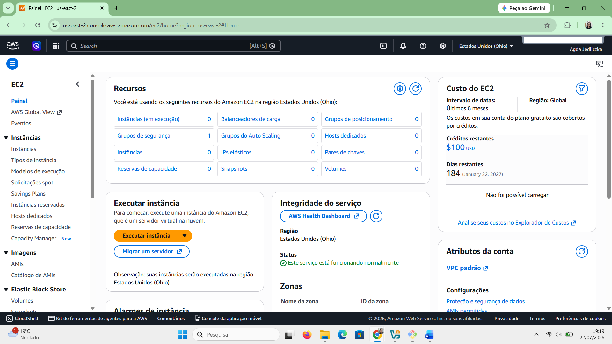

A instância foi configurada na região `us-east-1`, correspondente à região US East (N. Virginia). Essa região foi escolhida por possuir ampla disponibilidade de recursos e por também ser mencionada na documentação da Dadosfera em suas informações de infraestrutura.

Durante a criação da instância, foi definido um nome identificador para facilitar sua localização e administração dentro do console da AWS.

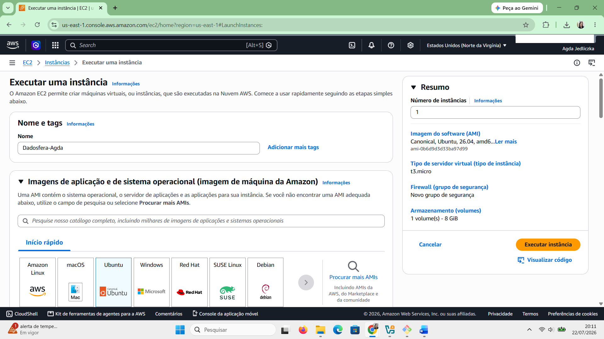

Como sistema operacional, foi selecionada uma imagem oficial do Ubuntu Server 26.04 LTS, disponibilizada pela Canonical. A versão escolhida atende ao requisito da Dadosfera de utilizar Ubuntu 20.04 ou superior e possui suporte de longo prazo, sendo adequada para ambientes de servidor, além de se aproximar de um ambiente corporativo real.

Foi selecionado o tipo de instância `t3.micro`, contendo 2 vCPUs e 1 GiB de memória RAM, o que atende ao requisito mínimo da documentação da Dadosfera e é suficiente para executar o Ubuntu Server, o MySQL e o OpenVPN durante o desenvolvimento do case técnico.

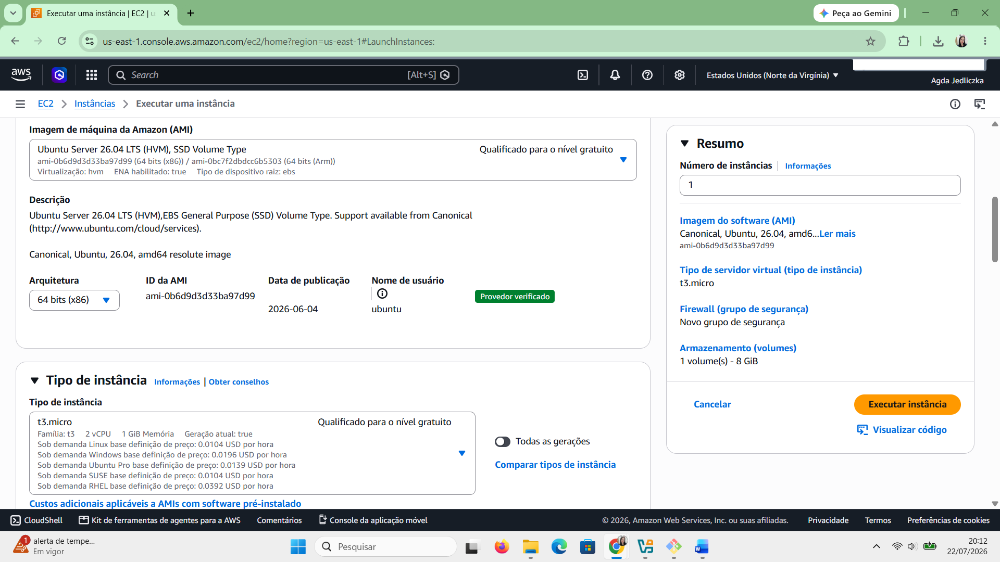

Para o acesso remoto ao servidor, foi criado um par de chaves SSH no formato `.pem`.

Na configuração de rede, foi utilizada a VPC padrão da AWS, com atribuição automática de um endereço IPv4 público. A zona de disponibilidade foi deixada sem preferência.

Também foi criado um Security Group, que atua como firewall virtual da instância. Foram adicionadas as seguintes regras de entrada:

- Porta TCP 22, utilizada pelo SSH, restrita ao meu endereço IP público;
- Porta UDP 1194, utilizada pelo OpenVPN, liberada para `0.0.0.0/0`, conforme solicitado na documentação da Dadosfera.

A porta 3306 do MySQL não foi aberta diretamente para a internet, pois o acesso ao banco será realizado por meio da VPN.

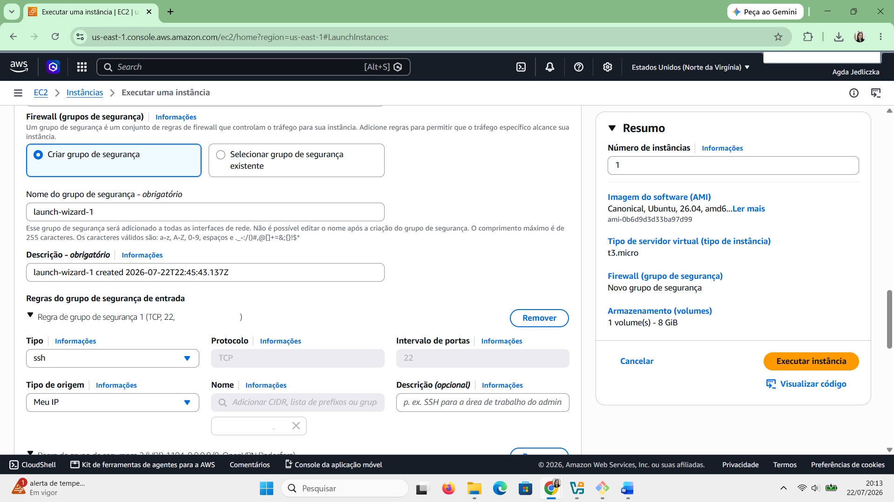

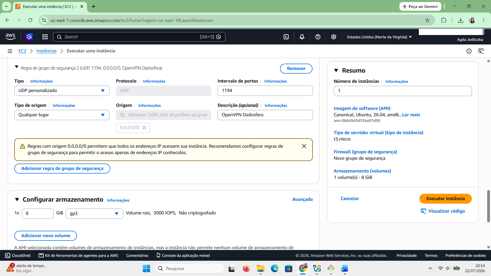

O armazenamento foi configurado com um volume de 8 GiB do tipo `gp3`, suficiente para armazenar o sistema operacional, as ferramentas instaladas, o banco MySQL e os arquivos utilizados no case. Não foram adicionados sistemas de arquivos compartilhados ou outros recursos adicionais.

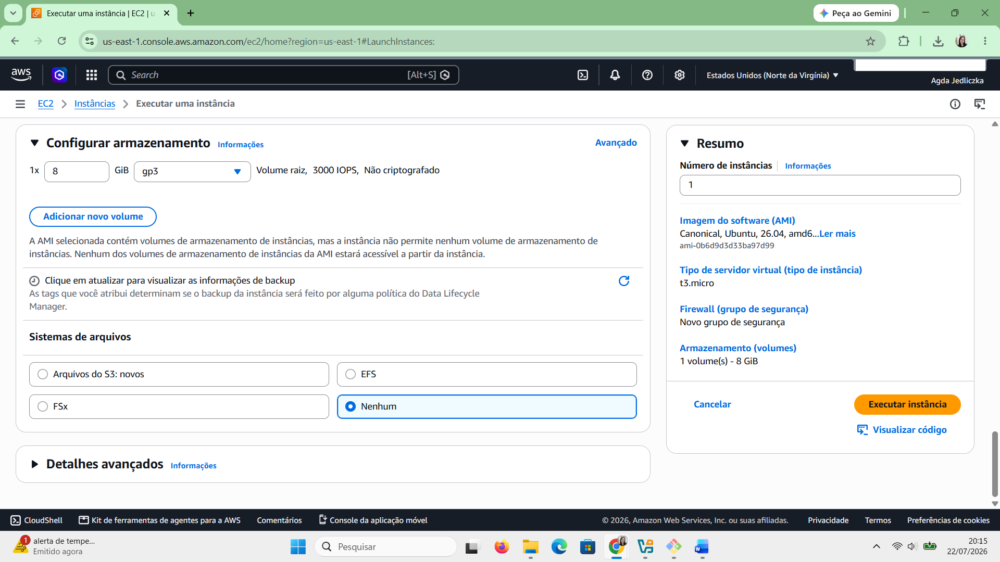

Após revisar as configurações, a instância foi criada e inicializada com sucesso. O console da AWS confirmou que o servidor estava em execução e havia recebido endereços IPv4 público e privado.

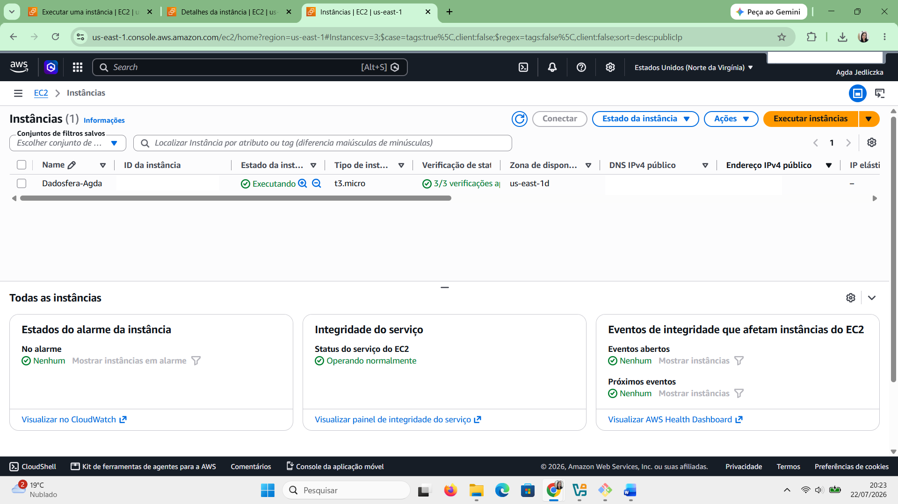

As informações sensíveis apresentadas nas evidências, como identificadores da conta, endereço IP público, DNS público e identificadores únicos da infraestrutura, foram ocultadas antes da publicação no repositório.

## Passo 2 – Preparação do servidor e instalação das ferramentas

O acesso ao servidor foi realizado por SSH utilizando o PowerShell do Windows, a chave privada `.pem`, o usuário padrão `ubuntu` e o endereço IPv4 público da instância.

O comando utilizado seguiu o seguinte formato:

powershell: `ssh -i "caminho_da_chave.pem" ubuntu@IP_PUBLICO_DA_INSTANCIA`

O SSH permite administrar a instância remotamente por meio do terminal, sem a necessidade de utilizar uma interface gráfica.

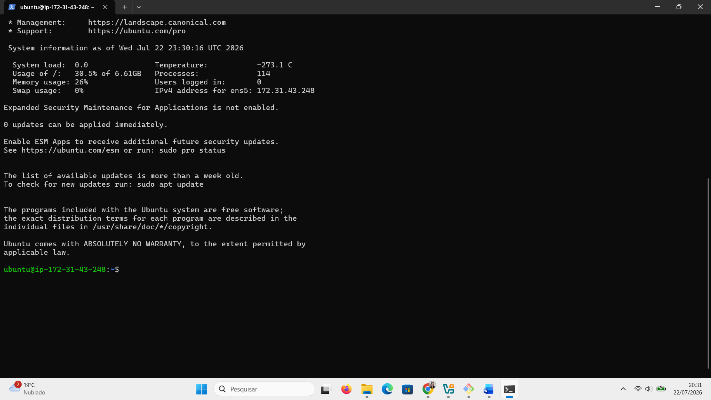

---

## Passo 3 – Atualização do Ubuntu e instalação das ferramentas

Após acessar o servidor, realizei a atualização da lista de pacotes disponíveis e dos componentes já instalados.

Foram executados os comandos:

bash:
`sudo apt update`
`sudo apt upgrade -y`

Essa etapa foi realizada antes da instalação das demais ferramentas para garantir que o servidor estivesse utilizando versões atualizadas e correções recentes de segurança.

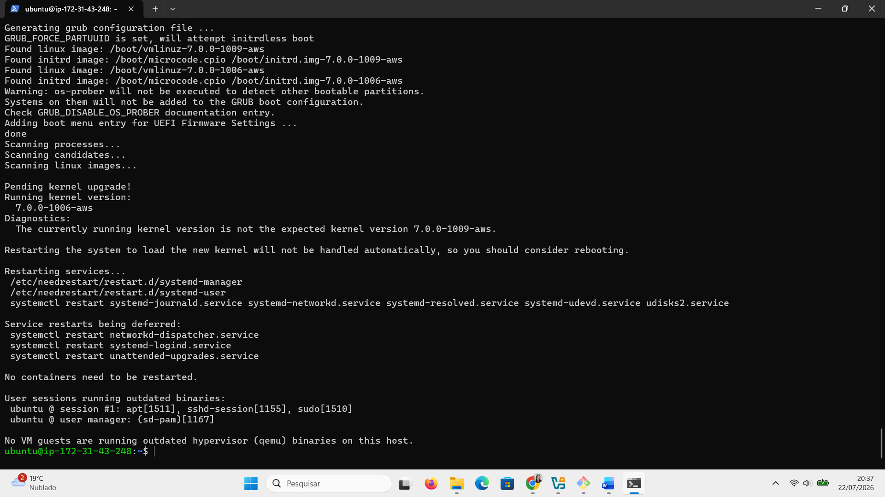

Em seguida, foram instaladas as ferramentas necessárias para a preparação do ambiente:

bash: `sudo apt install curl wget unzip vim net-tools mysql-server openvpn -y`

As ferramentas instaladas possuem as seguintes finalidades:

- `curl`: realização de requisições HTTP e testes de comunicação;
- `wget`: download de arquivos por linha de comando;
- `unzip`: extração de arquivos compactados;
- `vim`: edição de arquivos de configuração diretamente no terminal;
- `net-tools`: disponibilização de ferramentas de diagnóstico de rede, como o comando `ifconfig`;
- `mysql-server`: sistema gerenciador de banco de dados relacional;
- `openvpn`: ferramenta utilizada para a configuração da VPN nas próximas etapas.

Após a instalação, foram verificadas as versões do OpenVPN, MySQL e curl para confirmar que as ferramentas estavam disponíveis no ambiente.

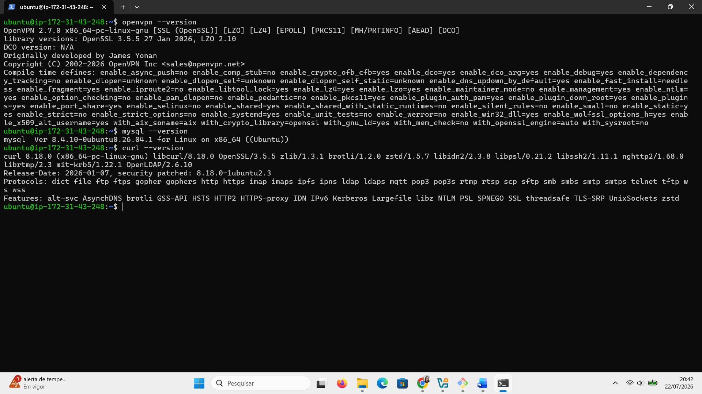

Também foi verificada a instalação do wget por meio da consulta de sua versão.

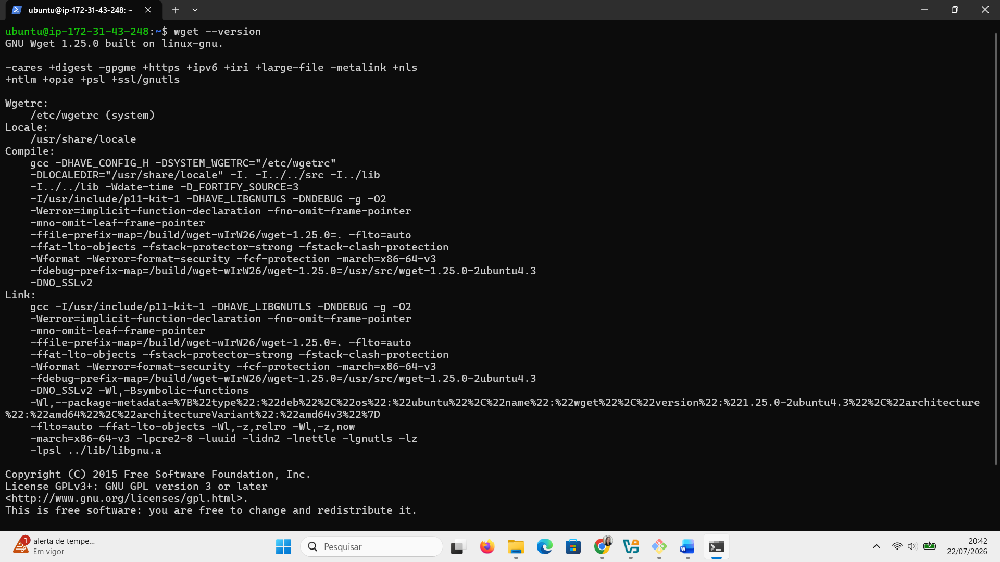

O pacote `net-tools` foi validado por meio do comando bash: `ifconfig`

Esse comando apresenta informações sobre as interfaces de rede do servidor, como endereços IP, máscara de rede, MTU e estatísticas de transmissão e recebimento de pacotes.

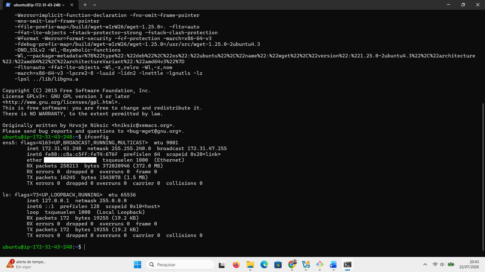

Por fim, foi verificado o status do serviço MySQL:

bash: `sudo systemctl status mysql`

O retorno `active (running)` confirmou que o serviço estava ativo e funcionando corretamente.

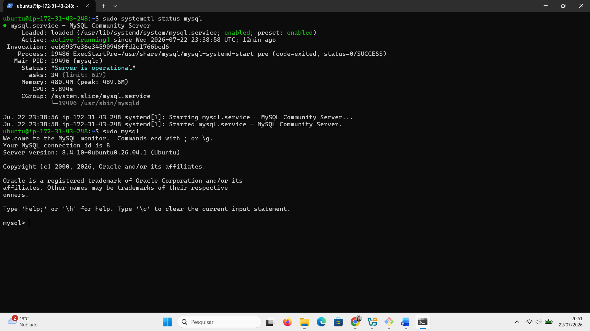

---

## Passo 4 – Criação do banco de dados

Após confirmar o funcionamento do MySQL, acessei o terminal do banco de dados com o comando bash: `sudo mysql`

O banco foi criado utilizando o padrão de nomenclatura solicitado no case técnico:

sql: `CREATE DATABASE agda_domingues_support_intern;`

Em seguida, o banco foi selecionado para a execução dos próximos comandos:

sql: `USE agda_domingues_support_intern;`

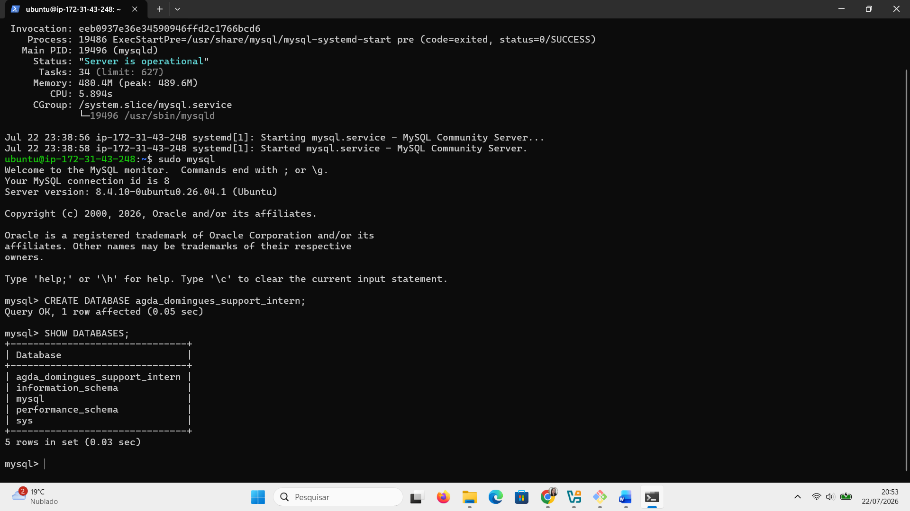

---

## Passo 5 – Análise e tratamento dos dados

O arquivo disponibilizado no case técnico continha quatro abas:

- `employee`;
- `performanceRating`;
- `environmentManagement`;
- `income`.

Inicialmente, durante a implementação realizada na máquina virtual local, havia sido considerada apenas a aba `employee`, pois o enunciado fazia referência à criação de uma tabela no singular.

Entretanto, após uma análise mais detalhada da planilha, optei por importar as quatro abas e representá-las como tabelas relacionais.

Essa abordagem permitiu:

- Preservar a organização original do conjunto de dados;
- Evitar a duplicação de informações;
- Representar corretamente os relacionamentos entre os registros;
- Demonstrar a aplicação de conceitos de modelagem de banco de dados;
- Permitir consultas envolvendo informações de diferentes categorias.

Durante a análise da aba `performanceRating`, foram identificadas duas inconsistências.

Uma das células da coluna `EmployeeNumber` apresentava o valor: `#NAME?`

A comparação dos identificadores entre as abas permitiu identificar que o registro correspondia ao funcionário de número 281.

Também foi encontrado um registro sem valor na coluna `PerformanceRating`. Como a ausência da avaliação poderia representar um dado válido, a coluna foi configurada para aceitar valores `NULL`.

---

## Passo 6 – Criação das tabelas

A tabela principal foi criada com o nome solicitado no case: `TB_agda_domingues_support_intern`

Essa tabela representa os dados da aba `employee`.

A coluna `EmployeeNumber` foi utilizada como chave primária, pois identifica unicamente cada funcionário dentro do conjunto de dados.

Durante a definição dos tipos das colunas, foram utilizados tipos numéricos para valores inteiros e tipos `VARCHAR` para campos textuais.

Os limites dos campos `VARCHAR` foram definidos considerando o maior valor existente em cada coluna e uma pequena margem para possíveis dados futuros.

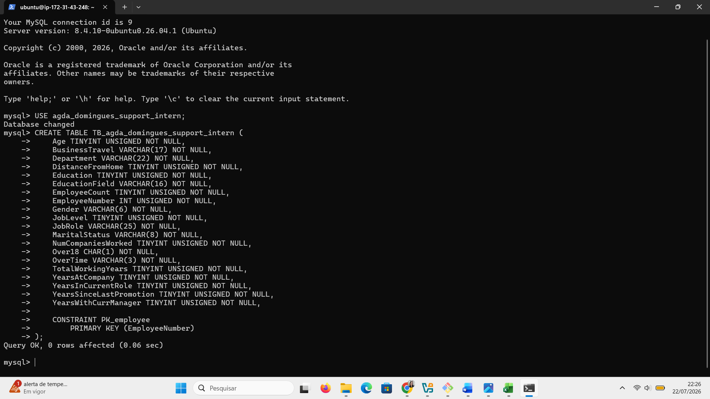

A segunda tabela criada foi: `TB_performance_rating`

Essa tabela representa a aba `performanceRating` e armazena a avaliação de desempenho de cada funcionário.

A coluna `PerformanceRating` foi configurada para aceitar valores nulos devido à ausência de uma avaliação em um dos registros da planilha.

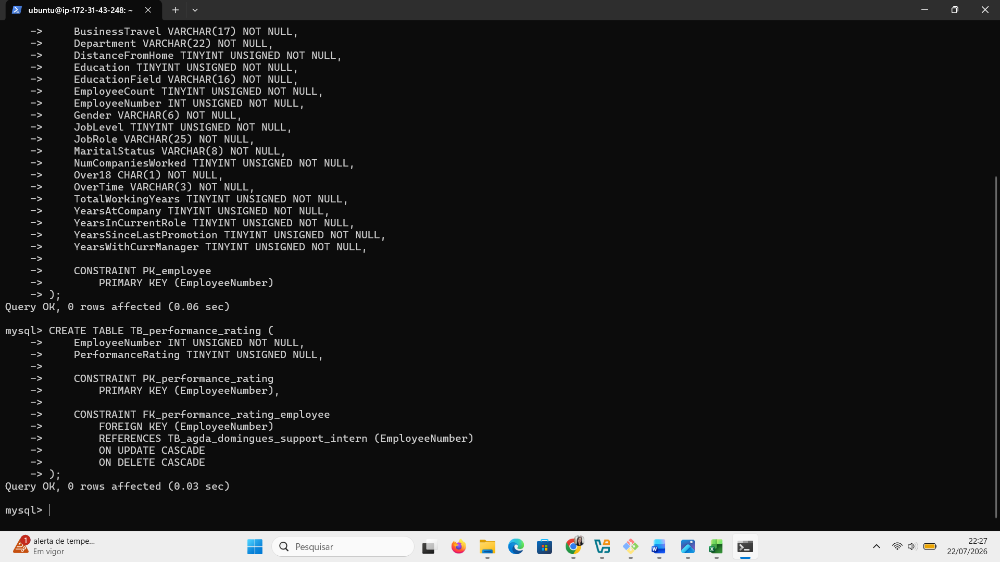

A terceira tabela criada foi: `TB_environment_management`

Essa tabela representa a aba `environmentManagement` e contém diversas informações relacionadas a satisfação do funcionário no ambiente de trabalho.

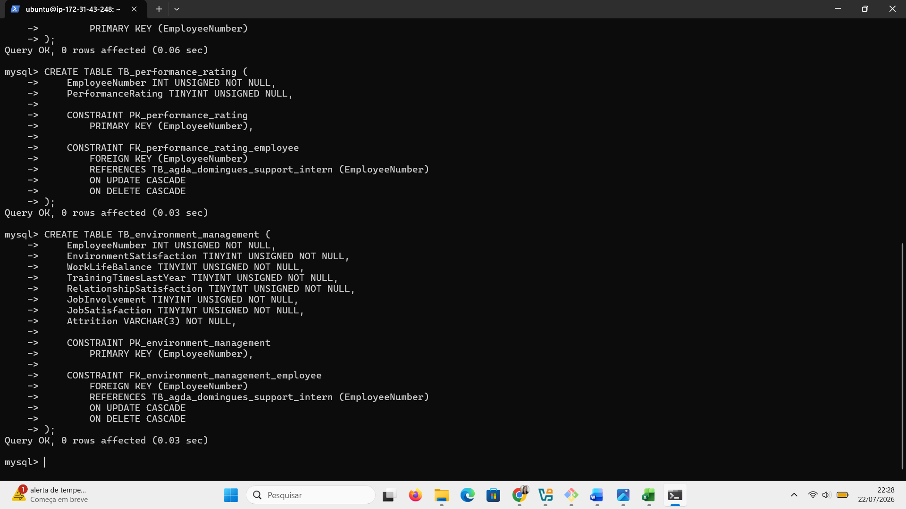

A quarta tabela criada foi: `TB_income`

Essa tabela representa a aba `income` e armazena informações financeiras e salariais relacionadas aos funcionários.

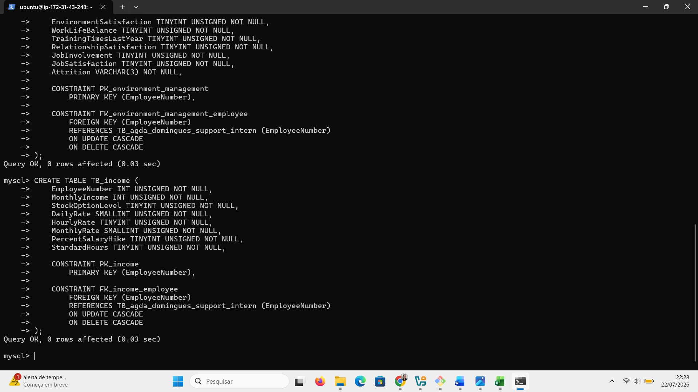

As três tabelas complementares utilizam a coluna `EmployeeNumber` como chave primária e também como chave estrangeira.

A chave estrangeira referencia a coluna `EmployeeNumber` da tabela principal `TB_agda_domingues_support_intern`

Os relacionamentos foram definidos como um para um, pois cada funcionário possui apenas um registro correspondente em cada uma das abas complementares.

Também foram utilizadas as opções:

sql: `ON UPDATE CASCADE`
`ON DELETE CASCADE`

A opção `ON UPDATE CASCADE` faz com que uma eventual atualização no identificador do funcionário seja propagada para as tabelas relacionadas.

A opção `ON DELETE CASCADE` garante que, caso um funcionário seja removido da tabela principal, seus registros relacionados também sejam removidos, evitando a existência de dados órfãos.

Após a criação, as tabelas foram verificadas com o comando:

sql: `SHOW TABLES;`

As constraints e os relacionamentos também foram consultados por meio das tabelas de metadados do MySQL.

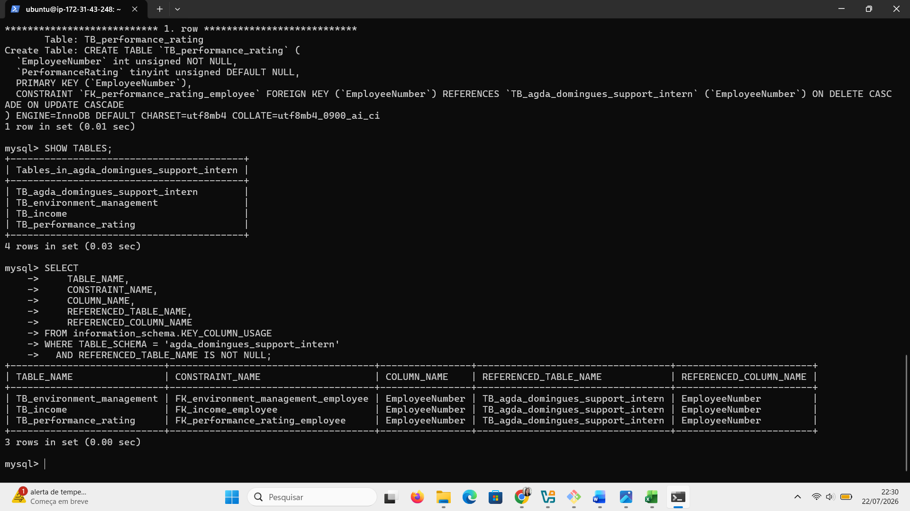

---

## Passo 7 – Conversão e envio dos arquivos CSV

Para realizar a importação, cada aba da planilha foi exportada separadamente no formato CSV UTF-8.

Foram gerados os seguintes arquivos:

`employee.csv`
`performanceRating.csv`
`environmentManagement.csv`
`income.csv`

O formato CSV foi escolhido porque pode ser importado diretamente pelo MySQL com o comando `LOAD DATA INFILE`. Os arquivos foram enviados do computador local para a instância EC2 por meio do protocolo SCP.

O comando utilizado seguiu o seguinte formato:

powershell: `scp -i "caminho_da_chave.pem" "caminho_do_arquivo.csv" ubuntu@IP_PUBLICO:/home/ubuntu/`

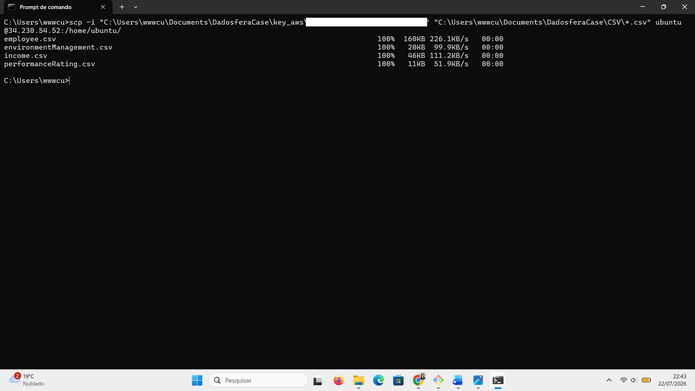

Após a transferência, a presença dos arquivos no servidor foi verificada com comandos como:

bash: `ls -lh /home/ubuntu/*.csv`

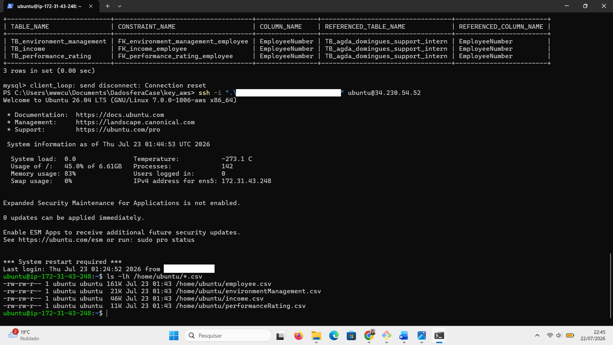

---

## Passo 8 – Preparação dos arquivos para importação

Antes da importação, consultei o diretório autorizado pelo MySQL para leitura de arquivos. A consulta foi realizada com:

sql: `SHOW VARIABLES LIKE 'secure_file_priv';`

O resultado indicou o diretório `/var/lib/mysql-files/`

Por isso, os arquivos CSV foram copiados para essa pasta.

Também foram ajustados o proprietário e as permissões dos arquivos para permitir que o processo do MySQL realizasse a leitura. Foram utilizados comandos como:

bash: `sudo cp /home/ubuntu/arquivo.csv /var/lib/mysql-files/`
`sudo chown mysql:mysql /var/lib/mysql-files/arquivo.csv`
`sudo chmod 640 /var/lib/mysql-files/arquivo.csv`

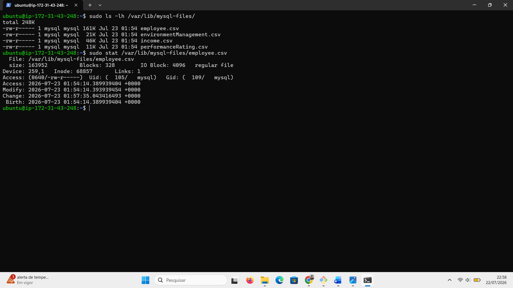

---

## Passo 9 – Importação da tabela principal

Como as tabelas complementares possuem chaves estrangeiras que dependem da tabela principal, a aba `employee` precisou ser importada primeiro.

A importação foi realizada com o comando `LOAD DATA INFILE`.

A primeira linha do arquivo, que contém os nomes das colunas, foi ignorada com `IGNORE 1 LINES`

O arquivo foi configurado como delimitado por ponto e vírgula e com possibilidade de campos entre aspas.

Após a importação, a tabela principal passou a conter os registros necessários para validar as chaves estrangeiras das demais tabelas.

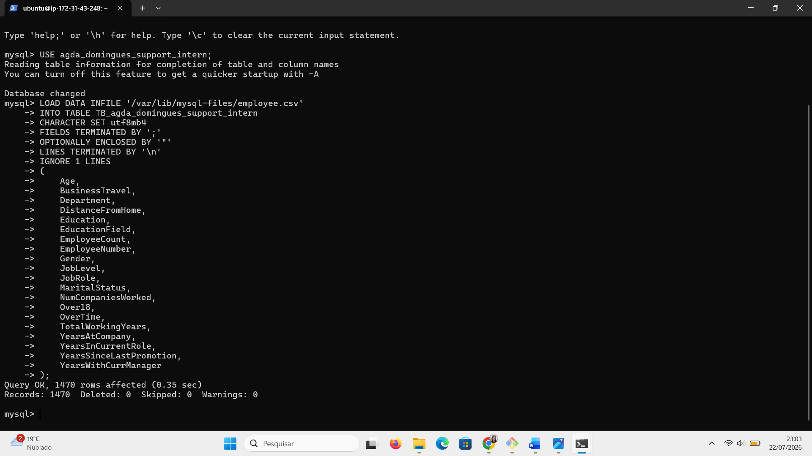

---

## Passo 10 – Importação da tabela de avaliação de desempenho

A segunda importação realizada foi a da tabela `TB_performance_rating`

Como um dos registros possuía a coluna `PerformanceRating` vazia, o valor foi inicialmente carregado em uma variável temporária.

Em seguida, foi utilizada uma condição para transformar valores vazios ou representados pelo texto `NULL` em um valor nulo válido no MySQL.

Também foram removidos possíveis caracteres `\r` presentes no final dos campos devido às quebras de linha originalmente geradas pelo Windows.

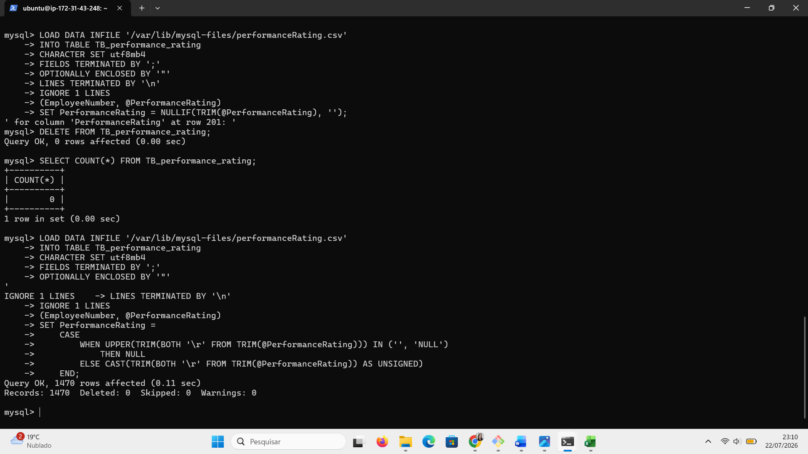

---

## Passo 11 – Importação da tabela de ambiente e satisfação

Na sequência, foi importada a tabela `TB_environment_management`

Durante uma das primeiras tentativas, a tabela apresentou apenas 1012 registros, em vez dos 1470 esperados.

Após a investigação, foi identificado que o problema não estava na estrutura do banco ou no comando de importação, mas no próprio arquivo CSV, que havia sido gerado de forma incompleta.

O arquivo foi exportado novamente a partir da planilha original, sua quantidade de linhas foi conferida e o novo CSV foi reenviado para a instância.

Após substituir o arquivo incompleto, a importação foi refeita com sucesso.

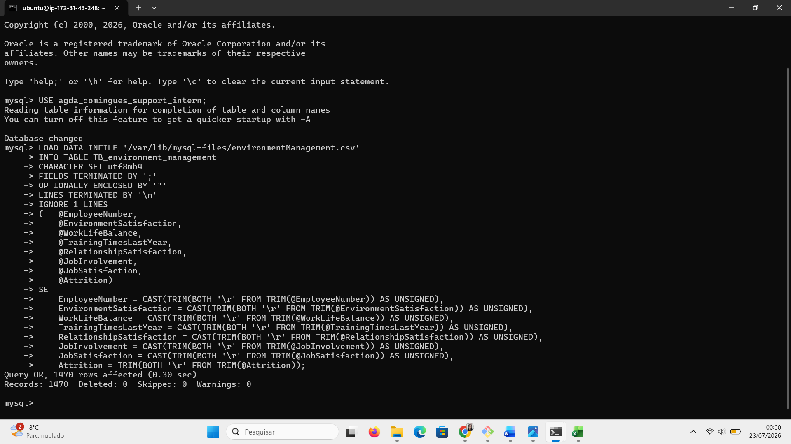

---

## Passo 12 – Importação da tabela de renda

Por último, foi importada a tabela `TB_income`

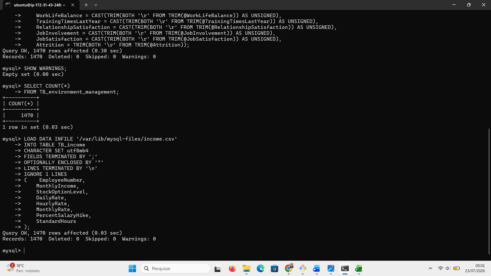

---

## Passo 13 – Validação das tabelas populadas

Após concluir as quatro importações, foram executadas consultas com `COUNT(*)` para verificar a quantidade de registros existentes em cada tabela. O resultado confirmou que todas as tabelas estavam populadas com 1470 registros.

Além da quantidade de registros, as chaves estrangeiras garantem que todos os registros das tabelas complementares correspondam a funcionários existentes na tabela principal.

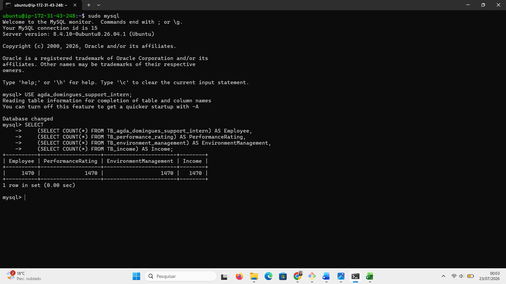

---

## Resultado do Step 2

Ao final desta etapa, o ambiente ficou preparado para a configuração da VPN e para a integração com a plataforma da Dadosfera.

O Step 2 foi concluído com os seguintes resultados:

- Instância criada e executada na AWS EC2;
- Servidor Ubuntu acessível por SSH;
- Regras de entrada configuradas no Security Group;
- Porta UDP 1194 liberada para a configuração da VPN;
- Porta SSH restrita ao endereço IP autorizado;
- Sistema operacional atualizado;
- OpenVPN instalado;
- MySQL Server instalado e ativo;
- Banco `agda_domingues_support_intern` criado;
- Quatro tabelas relacionais modeladas;
- Chaves primárias e estrangeiras configuradas;
- Inconsistências da planilha identificadas e tratadas;
- Arquivos CSV transferidos e preparados para importação;
- 1470 registros importados em cada tabela;
- Integridade dos relacionamentos preservada.

Com isso, o banco de dados e a infraestrutura necessária para os próximos passos do case técnico foram configurados com sucesso.