# Step 2 – Criação de Banco de Dados

Nesse passo, é necessário configurar uma máquina virtual Linux com acesso à internet. Para isso, escolhi a distro Linux Ubuntu Server 26.04 LTS, por ser uma das mais recentes e ser muito utilizada no mundo corporativo. Além disso, a documentação da Dadosfera (fonte: https://docs.dadosfera.ai/docs/conectando-a-dadosfera-a-fontes-de-dados-privadas) especifica que os pré-requisitos para a conexão com a plataforma através de uma VPN são:
- Um servidor com sistema operacional Linux Ubuntu >= 20.04 com usuário root.
- É necessário que o servidor esteja em uma rede pública com acesso a internet.
- O Hardware Mínimo é de 1GB de memória e 1 CPU.
- Abrir porta 1194 UDP (ou uma porta custom a sua escolha) para o mundo (0.0.0.0/0).

Também escolhi o Oracle VirtualBox para realizar a virtualização, por já possuir familiaridade com a ferramenta.

O Step 2 foi dividido em duas etapas:
1. Configuração da VM e instalação das ferramentas necessárias;
2. Criação do banco de dados, tabela e popular os dados.

## Passo 1 - Configuração da Máquina Virtual
Dentro do VirtualBox, configurei uma máquina virtual chamada "Dadosfera-ubuntu" com a distro Ubuntu Server 26.04, memória de 2048 MB, 2 processadores e espaço no hard disk de 25 GB. Foram alocados 2 GB de memória RAM e 2 vCPUs por serem valores superiores ao mínimo especificado pela documentação da Dadosfera (1 GB e 1 CPU), proporcionando maior estabilidade durante a instalação do Ubuntu, MySQL e OpenVPN.
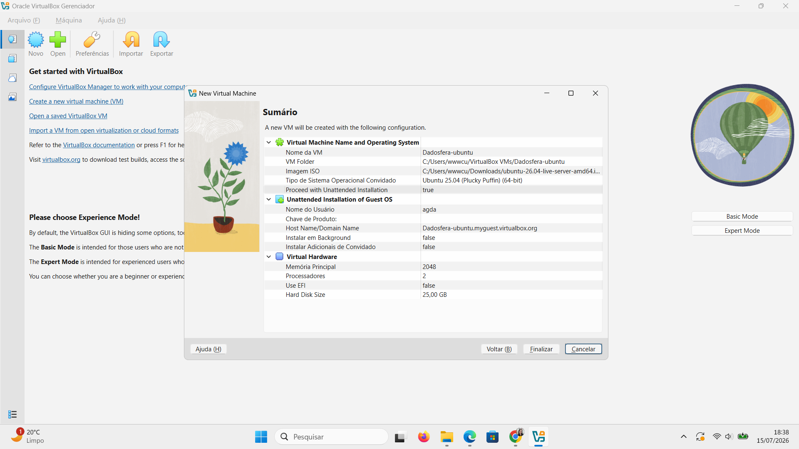

Também é possível conferir as configurações no seguinte print:
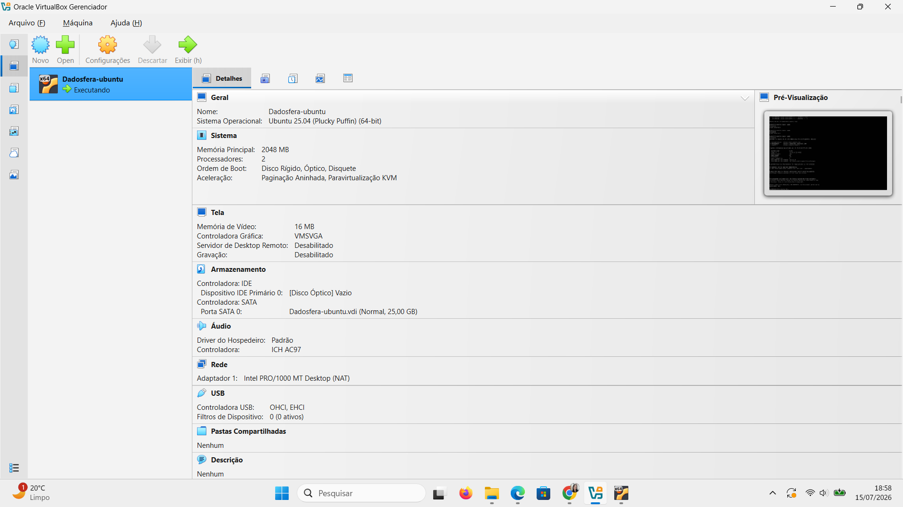

Durante a configuração da máquina virtual, foi observado que o Oracle VirtualBox exibia o perfil da VM como Ubuntu (25.04). Entretanto, essa informação corresponde apenas ao perfil de configuração definido na criação da máquina virtual e não à versão efetivamente instalada. A versão do sistema operacional foi confirmada diretamente pelo próprio Ubuntu por meio dos comandos ```cat /etc/os-release``` e ```hostnamectl```, que retornaram Ubuntu Server 26.04.
Também testei os comandos ```whoami``` e ```ip a``` para verificar o usuário do servidor e o ip.
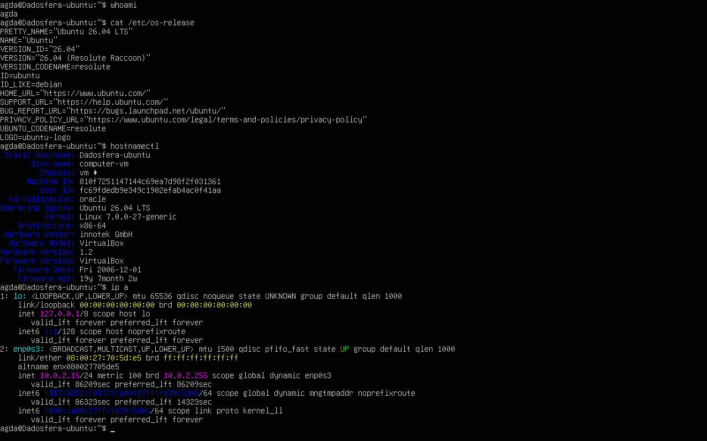

Após iniciar a VM e verificar algumas de suas informações, realizei a atualização dos pacotes do SO com o comando ```sudo apt update``` e ```sudo apt upgrade -y```
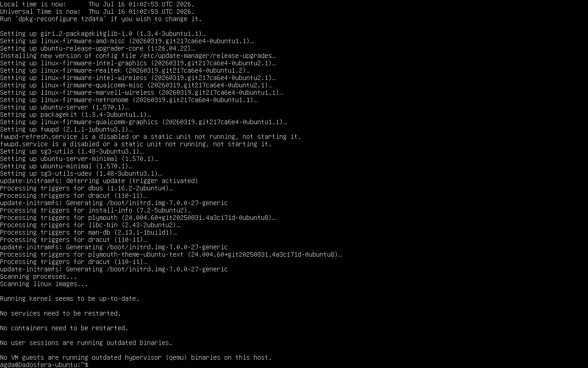

Então, para preparar o ambiente, foram instaladas algumas ferramentas auxiliares com o comando ```sudo apt install curl wget unzip vim net-tools -y```:
- curl: realização de requisições HTTP e download de arquivos;
- wget: download de arquivos pela linha de comando;
- unzip: extração de arquivos compactados;
- vim: edição de arquivos de configuração;
- net-tools: comandos de diagnóstico de rede, como ifconfig.
É possível observar a versão do curl e do wget nos próximos prints:
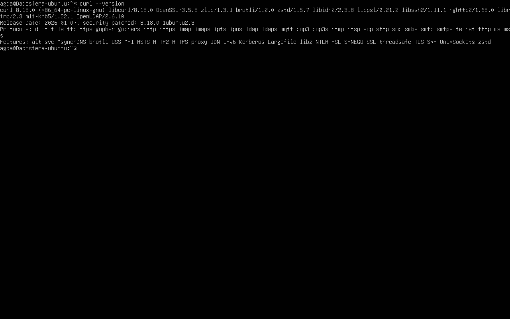
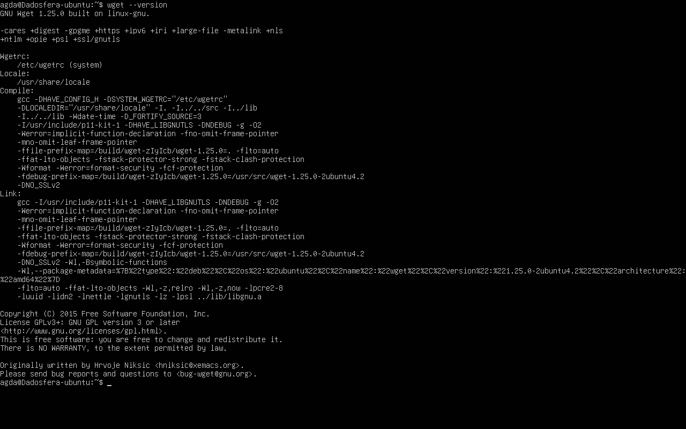

Por fim, instalei o MySQL Server como banco de dados, com o comando ```sudo apt install mysql-server -y```. Após finalizar a instalação, usei o comando ```mysql --version``` para conferir a versão do MySQL e ```sudo systemctl is-enabled mysql``` para conferir se o MySQL estava configurado para iniciar automaticamente sempre que a VM for ligada:
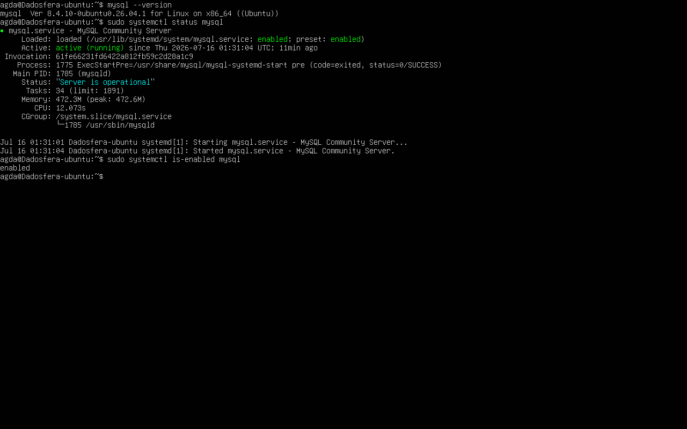

## Passo 2 - Criação do Banco de Dados
Após realizar o acesso ao MySQL com o comando ```sudo mysql```, criei o banco de dados com o nome conforme o padrão do case técnico com o comando ```CREATE DATABASE agda_domingues_support_intern;``` e o acessei com o comando ```USE agda_domingues_support_intern;```.
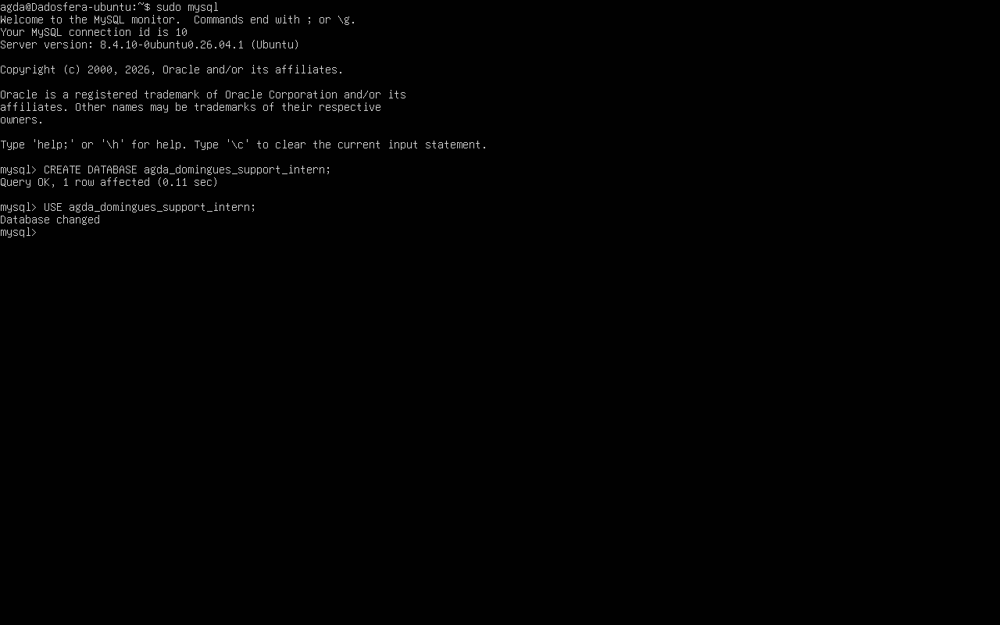

O arquivo Google Sheets disponibilizado para criar e popular o banco de dados continha quatro abas (employee, performanceRating, environmentManagement e income). Como o enunciado solicitava a criação de uma tabela e fazia referência singular ao conjunto de dados, optei por utilizar apenas a aba employee, por concentrar a maior quantidade de atributos necessários às análises posteriores.
Após analisar os dados de cada uma das colunas, escrevi a query para criação da tabela ```TB_agda_domingues_support_intern```. O limite das colunas VARCHAR foi decidido calculando o tamanho do maior item armazenado nela e arredondando para cima, pensando em evitar problemas caso, no futuro, fossem adicionados valores ligeiramente maiores.
A query SQL de criação da tabela pode ser verificada no print:
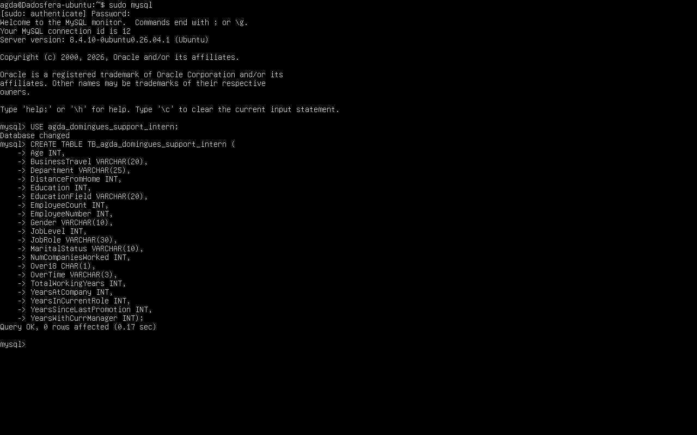

Para popular a tabela com os dados da planilha, decidi transformar a planilha com as informações de "employee" em um arquivo CSV e importar o arquivo por dentro do mysql.
Para facilitar a transferência de arquivos entre o computador host e a máquina virtual, foi instalado o OpenSSH Server na VM com o comando ```sudo apt install openssh-server``` e verificado o status dele com o comando ```sudo systemctl status ssh```.
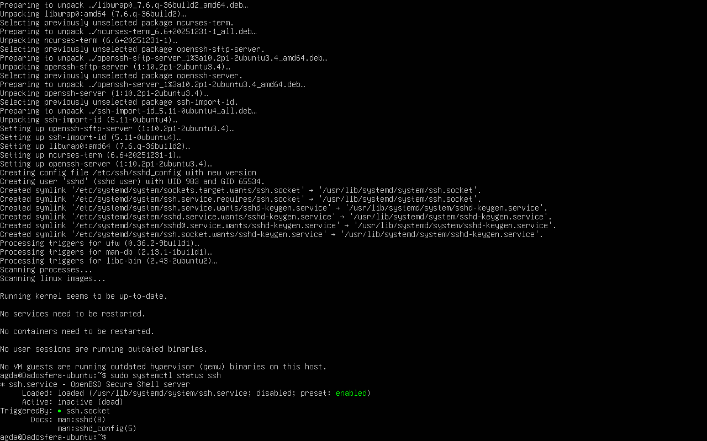

Após isso, a interface de rede foi alterada do modo NAT para Bridge para que a máquina virtual pudesse ser acessada diretamente pelo computador host através da rede local, permitindo a utilização do WinSCP. Verifiquei o ip do server e criei uma pasta chamada "data" com o comando ```mkdir -p ~/data```. Então, utilizando o WinSCP no computador host, fiz o envio do arquivo CSV para a VM.
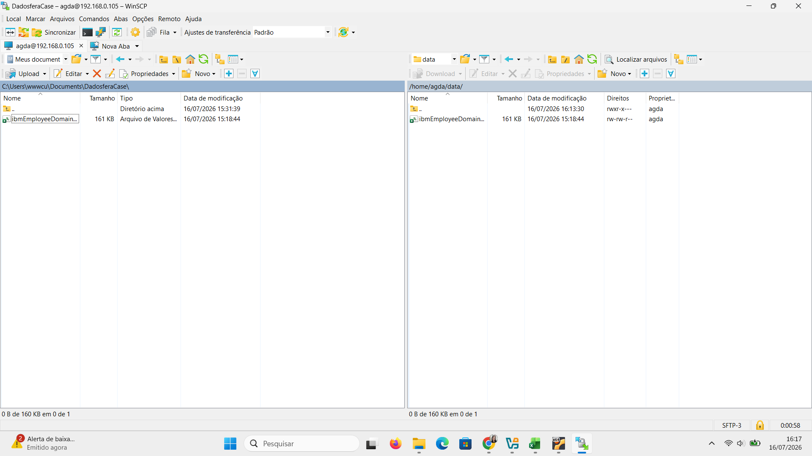

Então, inicialmente não consegui realizar a importação do arquivo que estava dentro da pasta "data" pelo MySQL. Executei o comando ```SHOW VARIABLES LIKE 'secure_file_priv';``` e descobri que o MySQL só permitia a importação de arquivos que estavam dentro do path ```/var/lib/mysql-files/```. Por isso, copiei o CSV de data para mysql-files e executei a seguinte query de importação do arquivo:
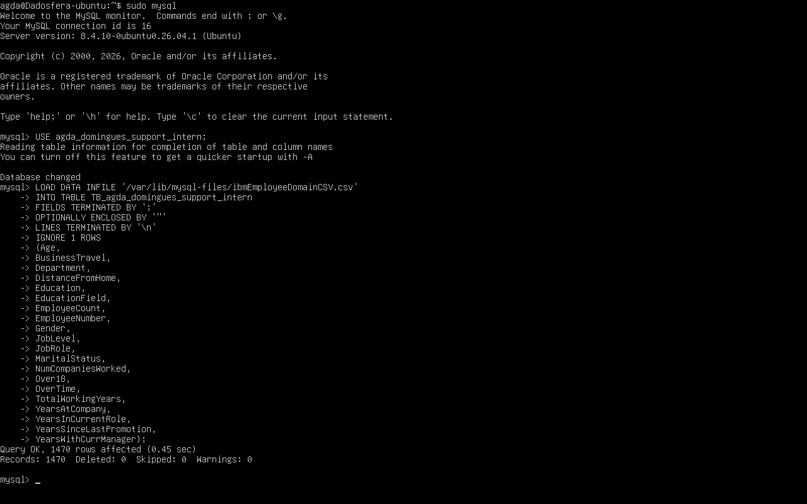

Para conferir que a importação foi realizada com sucesso, executei ```SELECT COUNT(*) FROM TB_agda_domingues_support_intern;``` para verificar se todos os registros foram registrados com sucesso e ```SELECT * FROM TB_agda_domingues_support_intern LIMIT 5;``` para verificar os 5 primeiros registros.
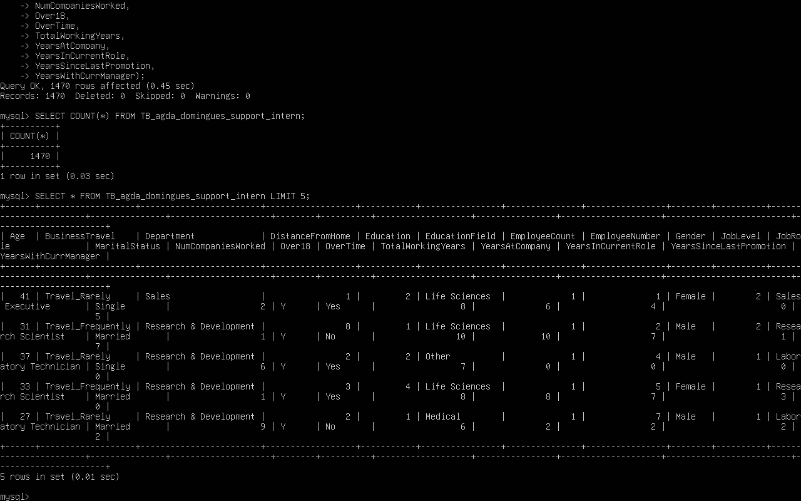

Ao final desta etapa, o ambiente estava completamente preparado para a configuração da VPN e integração com a plataforma Dadosfera, contendo um servidor Ubuntu funcional, MySQL instalado, banco de dados criado e populado com sucesso.