# Step 3 – Configuração e Conexão de VPN

Neste passo, foi necessário preparar o banco de dados para receber conexões remotas por meio de uma VPN, instalar e configurar o OpenVPN no servidor Ubuntu hospedado na AWS EC2, gerar o arquivo de configuração do cliente e cadastrar a conexão na plataforma da Dadosfera.

A configuração foi realizada com base na documentação oficial da Dadosfera para conexão com fontes de dados privadas. Como o MySQL e o servidor OpenVPN estavam instalados na mesma instância EC2, a arquitetura foi organizada para que o banco permanecesse sem exposição direta à internet, permitindo o acesso pela rede privada criada pela VPN.

A porta TCP 3306 do MySQL não foi adicionada ao Security Group com origem pública. Dessa forma, o acesso externo ao banco depende da conexão OpenVPN, enquanto a porta UDP 1194 permanece acessível para permitir o estabelecimento do túnel.

O Step 3 foi dividido em 9 passos menores:

1. Preparação da configuração do MySQL;
2. Criação de usuário específico para a Dadosfera;
3. Validação das permissões do usuário;
4. Download e validação do script do OpenVPN;
5. Execução do script de instalação;
6. Diagnóstico da interrupção da primeira execução;
7. Ajuste e validação do serviço OpenVPN;
8. Transferência do arquivo `.ovpn`;
9. Cadastro da VPN na plataforma Dadosfera.

---

## Passo 1 – Backup e preparação da configuração do MySQL

Antes de alterar a configuração do MySQL, foi criada uma cópia de segurança do arquivo `mysqld.cnf`.

O backup foi realizado para permitir a restauração da configuração original caso alguma alteração impedisse a inicialização do serviço.

O comando utilizado foi:

bash: `sudo cp /etc/mysql/mysql.conf.d/mysqld.cnf /etc/mysql/mysql.conf.d/mysqld.cnf.backup`

A existência dos dois arquivos foi verificada após a cópia.

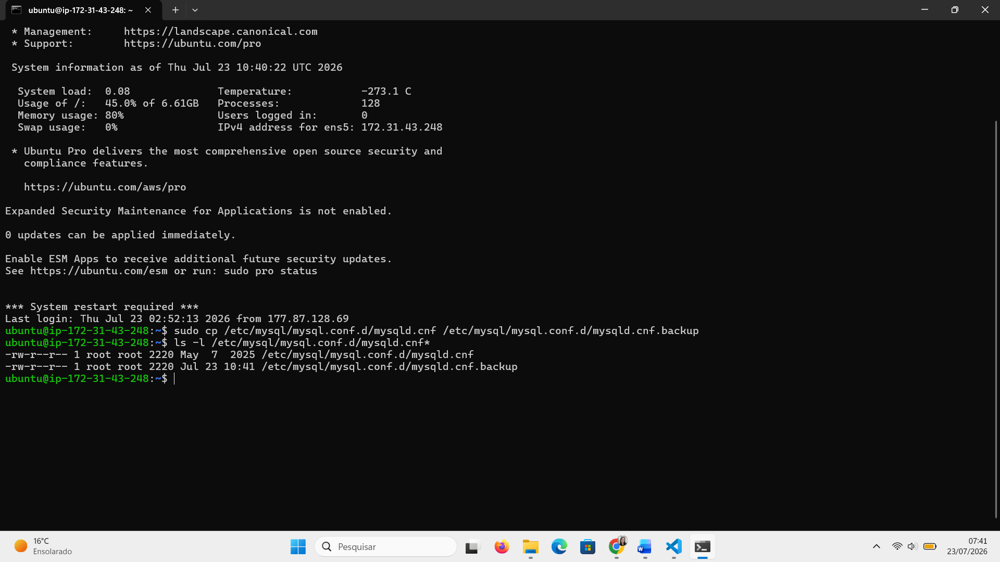

Em seguida, foi alterado o parâmetro `bind-address` do MySQL.

Por padrão, o serviço estava configurado para escutar apenas no endereço local `127.0.0.1`

A configuração foi alterada para `0.0.0.0`

Essa mudança permite que o MySQL aceite conexões pelas interfaces de rede disponíveis na instância, incluindo a interface privada utilizada pela VPN. A alteração do `bind-address` não expôs automaticamente o banco à internet, pois a porta 3306 continuou sem uma regra pública no Security Group da AWS.

Após a edição, a configuração foi validada e o serviço MySQL foi reiniciado.

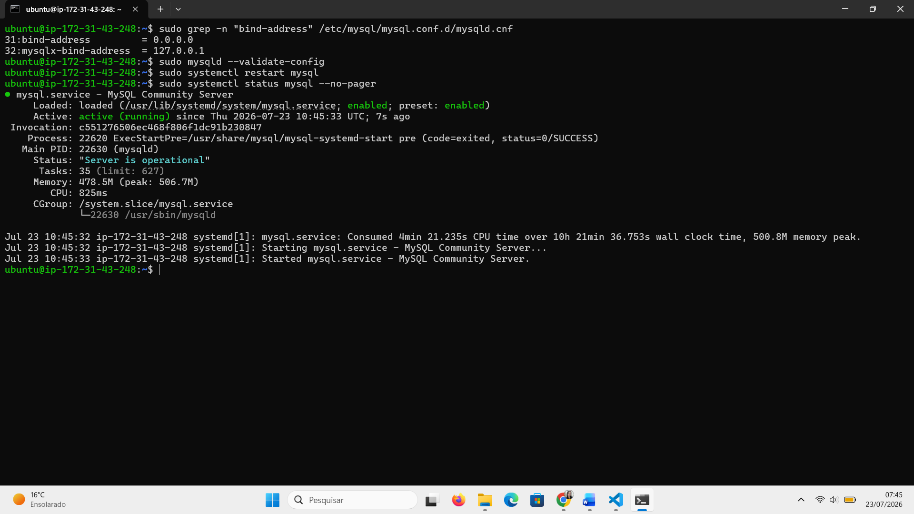

---

## Passo 2 – Criação do usuário do banco para a Dadosfera

Foi criado um usuário específico para a conexão da plataforma com o banco de dados.

O usuário foi definido com o nome `dadosfera`. O acesso foi configurado com o host `%`, permitindo autenticação por uma conexão remota válida. A restrição efetiva de acesso permaneceu sendo realizada pela infraestrutura de rede e pela VPN.

Para seguir o princípio do menor privilégio, o usuário recebeu somente permissão de leitura no banco.

Após a criação, foram verificadas as permissões atribuídas ao usuário.

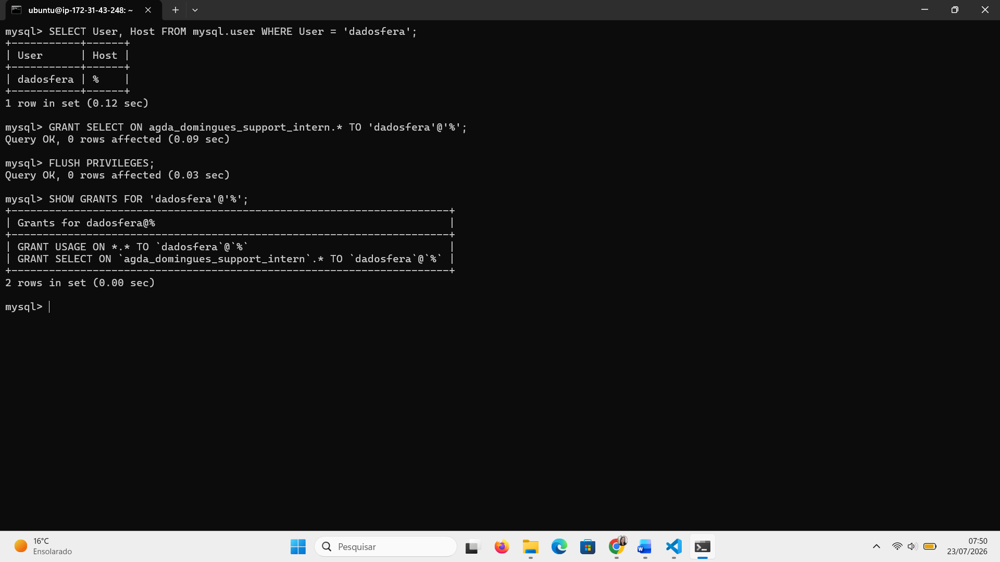

---

## Passo 3 – Teste de acesso e validação das permissões

O usuário `dadosfera` foi testado por meio de uma conexão TCP local com o MySQL.

O comando utilizado seguiu o seguinte formato:

bash: `mysql -h 127.0.0.1 -u dadosfera -p -D agda_domingues_support_intern`

Após a autenticação, foram executadas consultas para confirmar:

- O usuário conectado;
- O banco selecionado;
- As tabelas disponíveis;
- A leitura dos registros da tabela principal.

A contagem retornou os 1470 registros esperados.

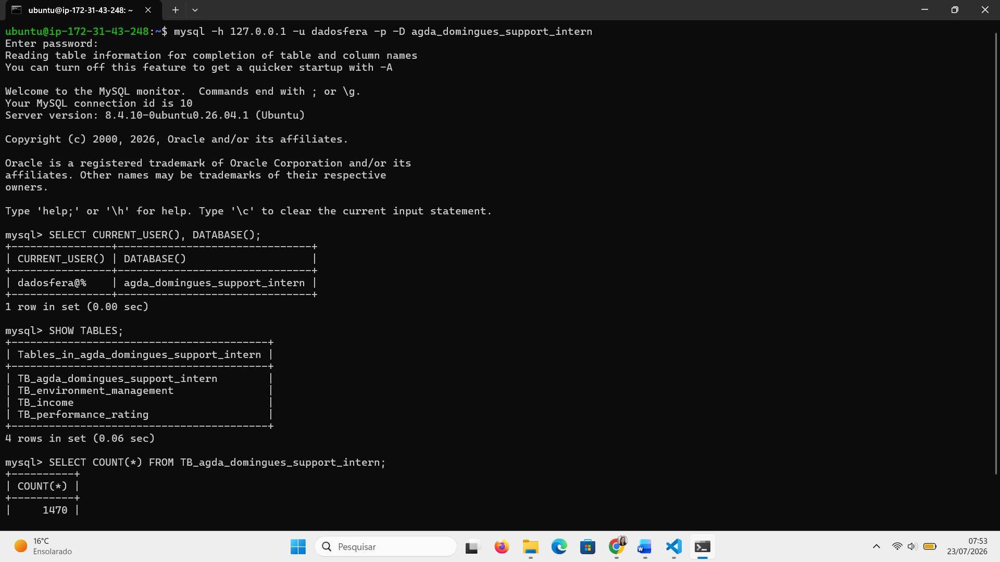

Também foi realizado um teste de tentativa de criação de tabela.

Como o usuário possuía apenas permissão `SELECT`, o comando foi recusado pelo MySQL.

Esse resultado confirmou que o usuário podia consultar os dados, mas não podia alterar a estrutura do banco.

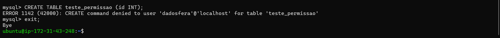

---

## Passo 4 – Acesso root e download do script do OpenVPN

A instalação do OpenVPN foi realizada seguindo o procedimento disponibilizado pela Dadosfera.

Inicialmente, foi acessado o usuário `root` com `sudo -i`

O script oficial foi baixado com o comando `wget https://app.dadosfera.ai/scripts/openvpn.sh`

A execução como `root` foi necessária porque o script realiza alterações em serviços, certificados, arquivos de configuração e regras de rede do sistema operacional, além de ser orientado o seu uso na documentação da empresa.

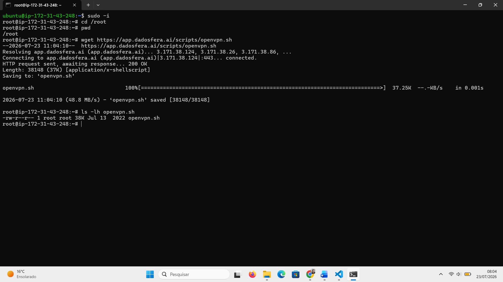

Antes da execução, o arquivo foi verificado para confirmar que havia sido baixado corretamente.

Foram consultados o tipo do arquivo, suas informações e as primeiras linhas do script.

Essa validação foi realizada como uma medida de segurança antes de executar um arquivo externo com privilégios administrativos.

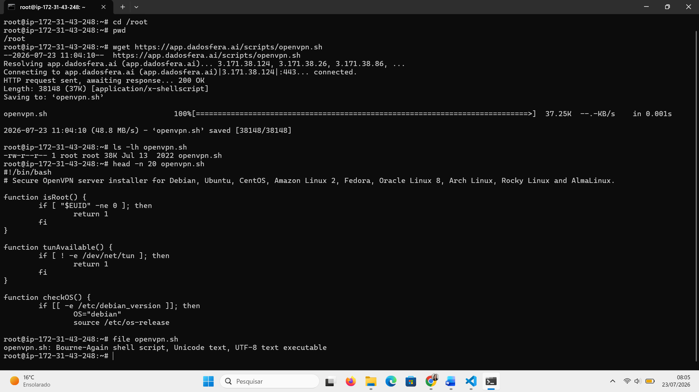

Em seguida, foi concedida permissão de execução `chmod +x openvpn.sh`

As permissões foram conferidas com `ls -l`, confirmando a presença do atributo de execução.

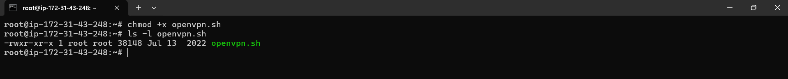

---

## Passo 5 – Execução do script do OpenVPN

O script foi iniciado com `./openvpn.sh`

Durante a configuração, foram mantidas as opções recomendadas para o ambiente:

- IPv4 público da EC2 como endereço externo do servidor;
- Porta UDP 1194;
- Protocolo UDP;
- Configurações padrão de criptografia;
- Criação de cliente para a Dadosfera;
- Rota específica para o IP privado da instância.

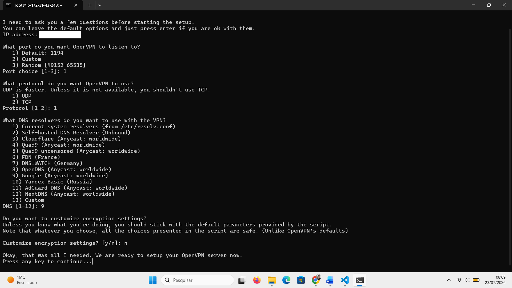

---

## Passo 6 – Diagnóstico da interrupção da primeira execução

Durante a primeira tentativa, o terminal deixou de apresentar novas mensagens após a atualização dos pacotes.

Inicialmente, foi considerada a possibilidade de o script estar travado. Foram executados comandos para verificar processos relacionados ao `apt`, `dpkg` e `openvpn.sh`. Nenhum processo ativo foi encontrado.

Após uma nova análise, foi identificado que o problema não estava no script, mas na desconexão da sessão SSH durante a execução.

O pacote OpenVPN havia sido instalado, porém os arquivos de configuração, certificados e o cliente `.ovpn` ainda não haviam sido gerados.

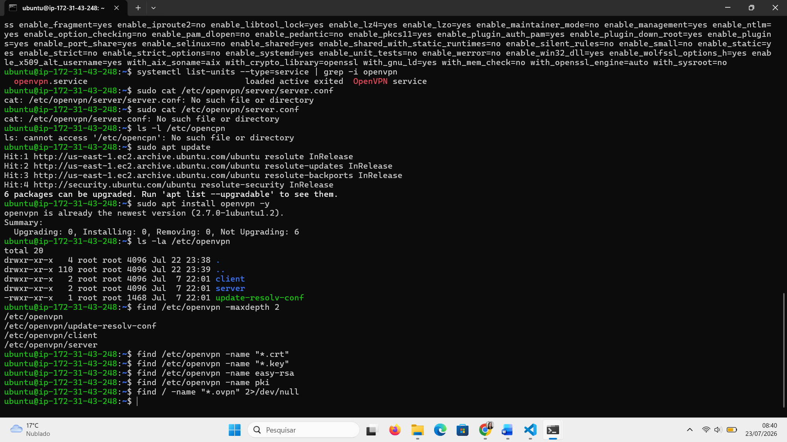

Para evitar que uma nova queda da conexão SSH interrompesse a instalação, foi utilizado o `tmux`, que mantém a sessão ativa no servidor mesmo quando a conexão SSH do computador local é encerrada.

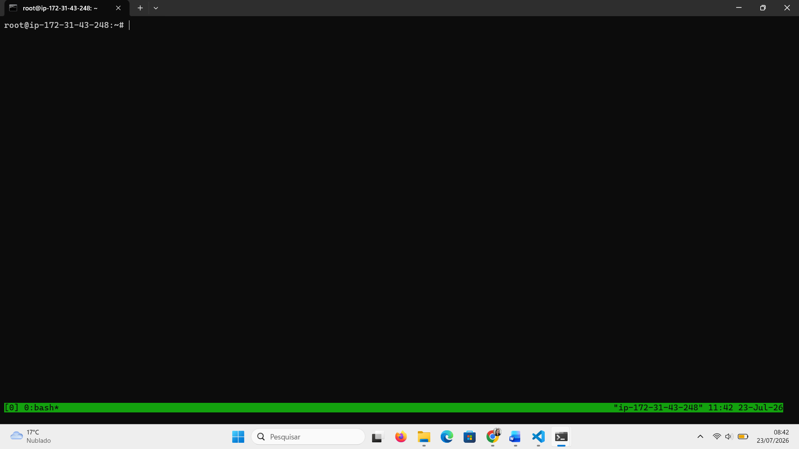

Dentro da sessão `tmux`, o script foi executado novamente e concluído.

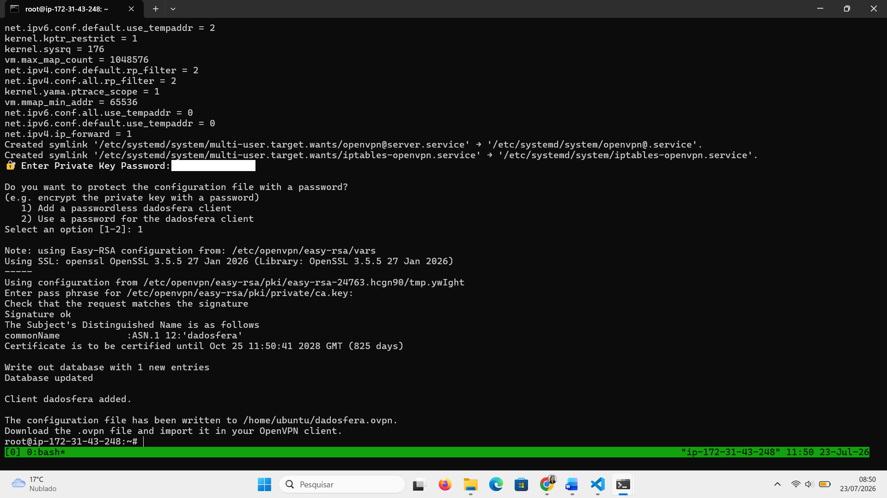

---

## Passo 7 – Ajuste e validação do serviço OpenVPN

Após a instalação, foi necessário validar o serviço responsável pela execução do OpenVPN.

O script utilizou o modelo de serviço `openvpn@server.service`, com o arquivo de configuração localizado em `/etc/openvpn/server.conf`

A validação confirmou:

- Serviço `active (running)`;
- Mensagem `Initialization Sequence Completed`;
- Porta UDP 1194 em escuta;
- Interface virtual `tun0` criada;
- Endereço privado da rede VPN atribuído.

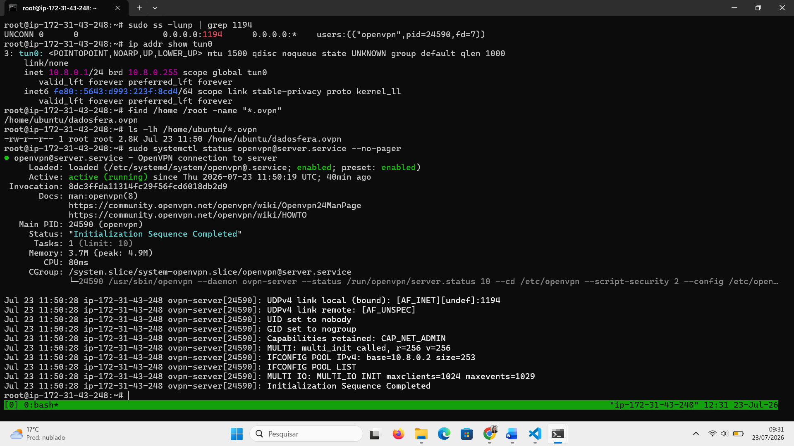

A porta 1194 já havia sido liberada no Security Group da AWS durante o Step 2.

A porta 3306 não foi liberada publicamente, pois o acesso ao MySQL foi mantido exclusivamente pela VPN.

---

## Passo 8 – Transferência do arquivo `.ovpn`

Após a geração do cliente, o arquivo foi localizado na instância.

Em seguida, o arquivo foi transferido da EC2 para o computador local por meio do protocolo SCP.

O comando seguiu o formato `scp -i "caminho_da_chave.pem" ubuntu@IP_PUBLICO:/home/ubuntu/dadosfera.ovpn .`

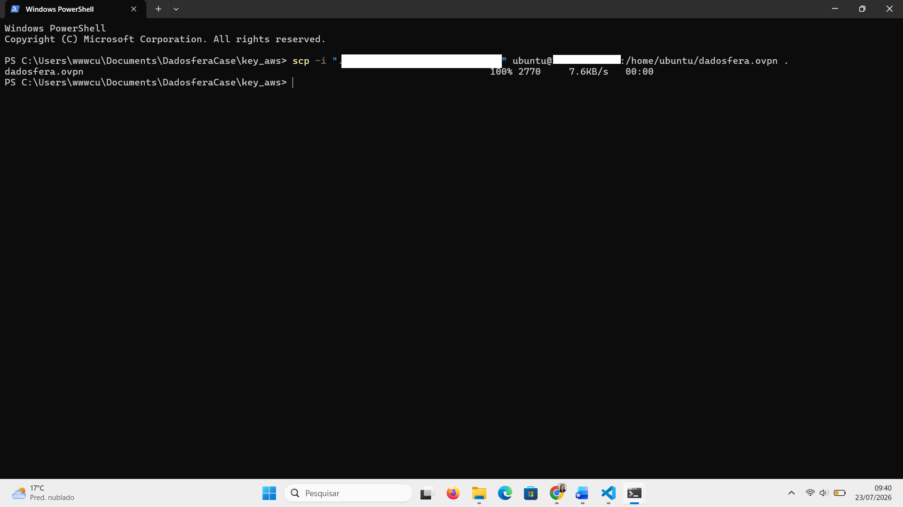

---

## Passo 9 – Cadastro da VPN na plataforma Dadosfera

Com o arquivo salvo no computador local, foi acessado o painel de gerenciamento de redes da plataforma Dadosfera.

Foi criada uma nova conexão OpenVPN e enviado o arquivo `dadosfera.ovpn`

A VPN foi cadastrada com uma descrição informando que a conexão permite acesso seguro ao banco MySQL hospedado em uma instância Ubuntu na Amazon EC2.

Após o envio do arquivo, a plataforma concluiu o cadastro da rede com sucesso.

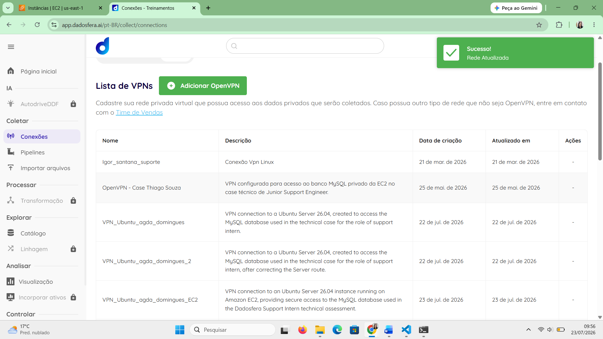

---

## Resultado do Step 3

Ao final desta etapa, o ambiente ficou preparado para a criação da fonte de dados MySQL na plataforma da Dadosfera.

O Step 3 foi concluído com os seguintes resultados:

- Backup do arquivo de configuração do MySQL realizado;
- `bind-address` alterado para aceitar conexões pelas interfaces da instância;
- MySQL validado e mantido ativo;
- Usuário `dadosfera` criado;
- Permissão restrita a consultas `SELECT`;
- Autenticação do usuário testada;
- Restrição de escrita validada;
- Script oficial do OpenVPN baixado e verificado;
- Permissão de execução aplicada ao script;
- Instalação retomada com segurança utilizando `tmux`;
- OpenVPN configurado na porta UDP 1194;
- Rota específica para o IP privado do servidor configurada;
- Serviço `openvpn@server.service` iniciado com sucesso;
- Interface `tun0` criada;
- Arquivo `dadosfera.ovpn` gerado;
- Arquivo transferido para o computador local por SCP;
- VPN cadastrada na plataforma da Dadosfera;
- Porta 3306 mantida sem exposição pública;
- Acesso ao banco preparado para ocorrer exclusivamente pelo túnel VPN.

Com isso, a infraestrutura de VPN foi configurada e conectada à plataforma, permitindo o avanço para o Step 4, no qual será criada e validada a conexão da fonte de dados MySQL na Dadosfera.