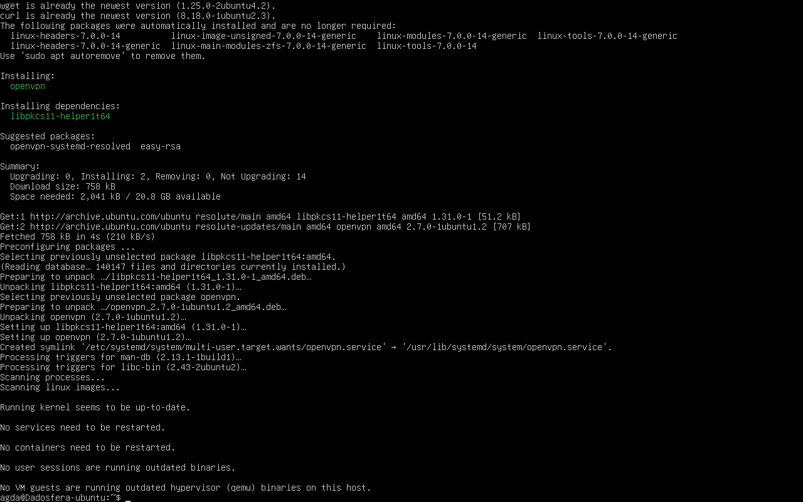
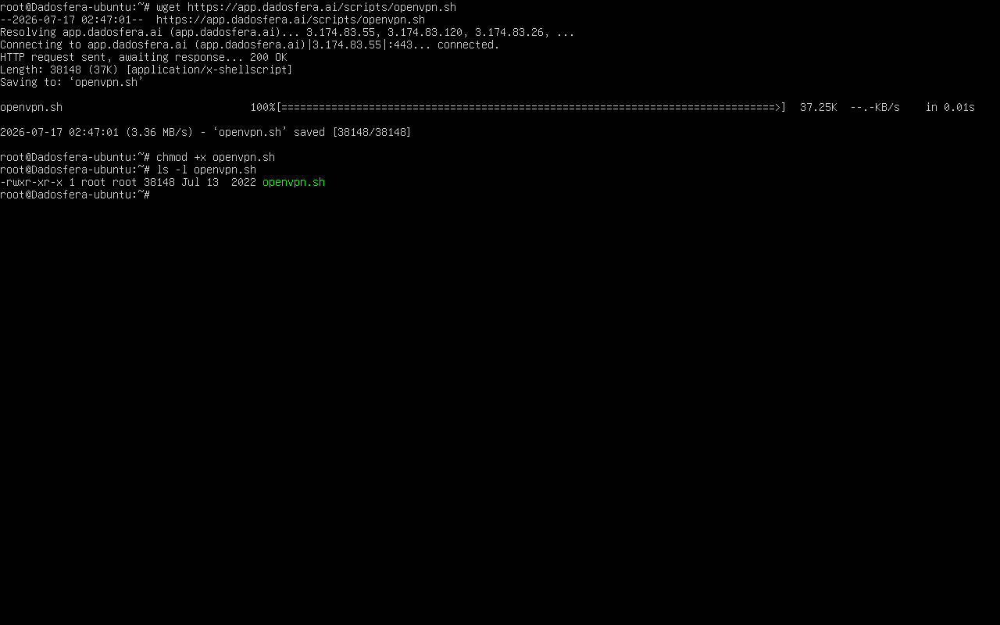
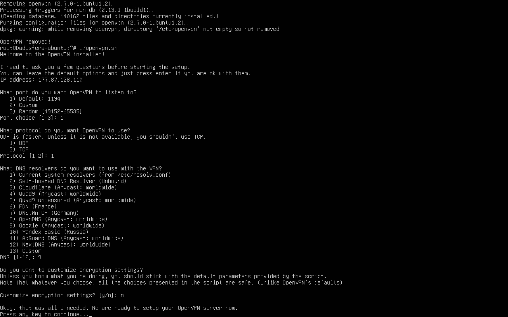
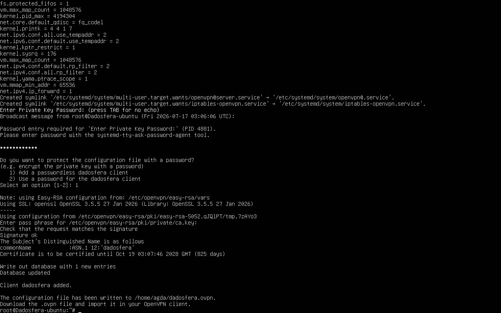
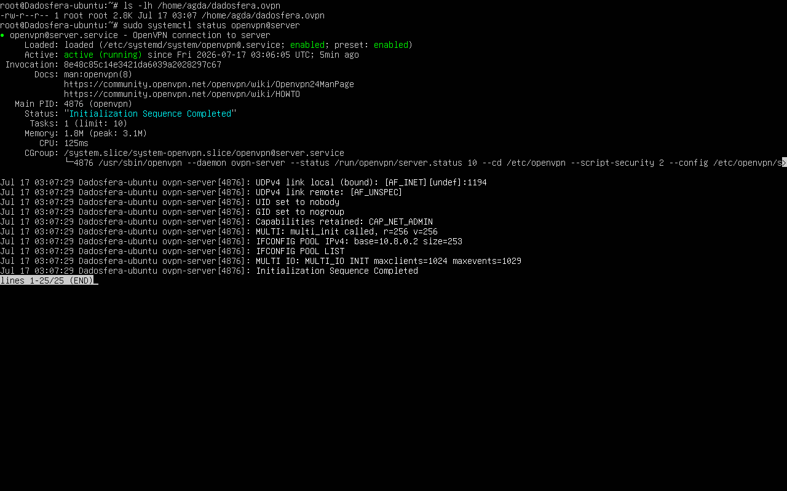
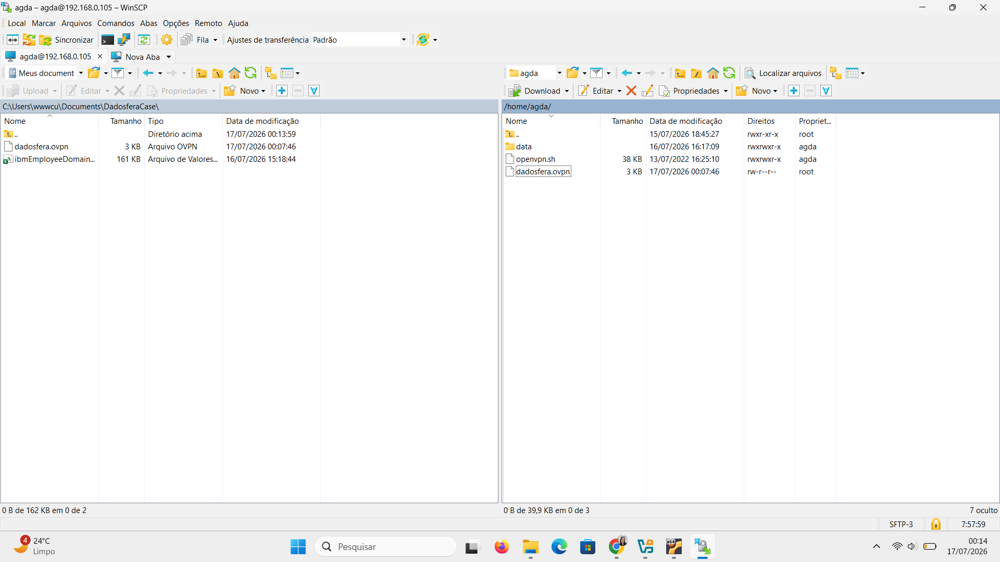

# Step 3 – Configuração e Conexão de VPN

O Step 3 consiste na configuração de um servidor OpenVPN para permitir que a plataforma Dadosfera acesse, de forma segura, recursos disponíveis na rede privada da máquina virtual. Para isso, foi seguida a documentação oficial disponibilizada pela empresa (https://docs.dadosfera.ai/docs/conectando-a-dadosfera-a-fontes-de-dados-privadas#vpn---como-instalar-na-sua-rede).

## Passo único - Instalação e configuração do OpenVPN
O OpenVPN foi instalado por ser a solução oficial adotada pela Dadosfera para comunicação segura entre a plataforma e fontes de dados localizadas em redes privadas. Para isso, utilizei o comando ```sudo apt install openvpn```.


Conforme orientado pela própria documentação da Dadosfera, todo o processo foi realizado utilizando o usuário root (comando ```sudo -i```), garantindo que o script tivesse permissão para instalar pacotes, criar certificados digitais e alterar configurações do sistema. Fiz o download do script de instalação e configuração do OpenVPN com o comando ```wget https://app.dadosfera.ai/scripts/openvpn.sh```. Dei permissão de execução com o comando ```chmod +x openvpn.sh```e utilizei ```ls -l openvpn.sh``` para confirmar que o script havia sido baixado corretamente.


Então, executei o script com o comando ```./openvpn.sh```. Durante a primeira execução do script, o processo foi interrompido antes da conclusão da configuração do servidor OpenVPN. Como consequência, uma nova execução do script não permitia mais a criação do cliente "dadosfera", indicando que parte da configuração já havia sido persistida. Para retornar o ambiente a um estado limpo, foi utilizada a opção de remoção completa do OpenVPN disponibilizada pelo próprio script, seguida de uma nova execução do processo de instalação.
As decisões tomadas durante a execução do script foram as mesmas que a documentação técnica sugere. Além disso, durante a configuração do script foi informada como rota apenas o endereço IP correspondente ao servidor MySQL, utilizando máscara 255.255.255.255, conforme recomendado pela documentação da Dadosfera. Essa abordagem restringe o acesso somente ao recurso necessário e evita o encaminhamento de todo o tráfego pela VPN.



Para conferir que o arquivo foi de fato gerado, executei ```ls -lh /home/agda/dadosfera.ovpn``` e verifiquei que o serviço OpenVPN estava ativo executando o comando ```sudo systemctl status openvpn@server```.


Após isso, utilizei o WinSCP para transferir o arquivo .ovpn do servidor Linux para o host Windows, uma vez que esse arquivo é utilizado posteriormente durante o cadastro da VPN na plataforma Dadosfera.


A etapa seguinte do processo consistia no cadastro da VPN na plataforma Dadosfera utilizando o arquivo .ovpn gerado. Entretanto, essa atividade depende de credenciais de acesso à plataforma, as quais foram solicitadas em 17/07/2026. Como essas credenciais não foram disponibilizadas até o prazo de elaboração deste relatório, não foi possível concluir a validação da VPN pela interface da plataforma. Ainda assim, todas as atividades que podiam ser executadas localmente foram concluídas e documentadas.