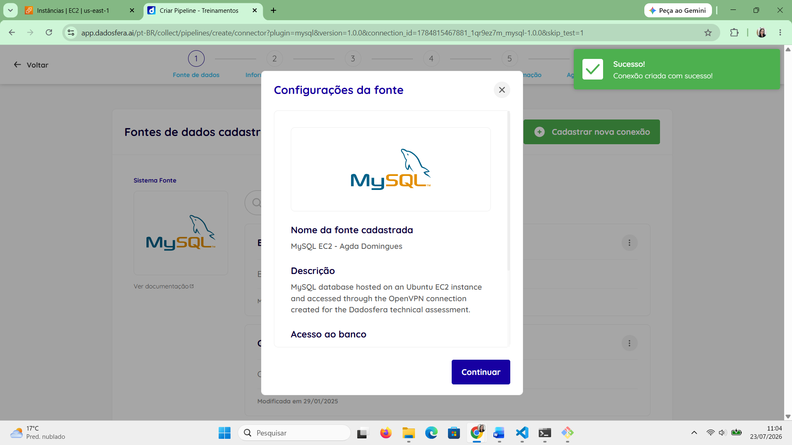
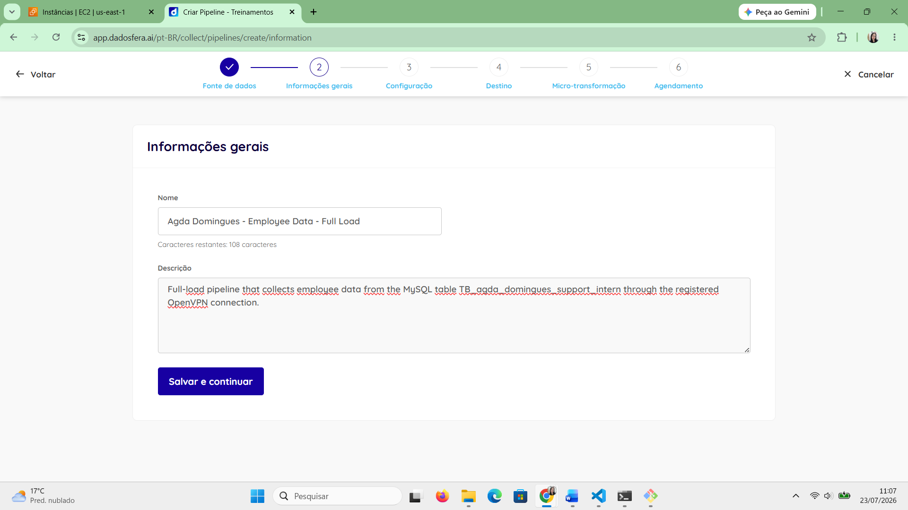
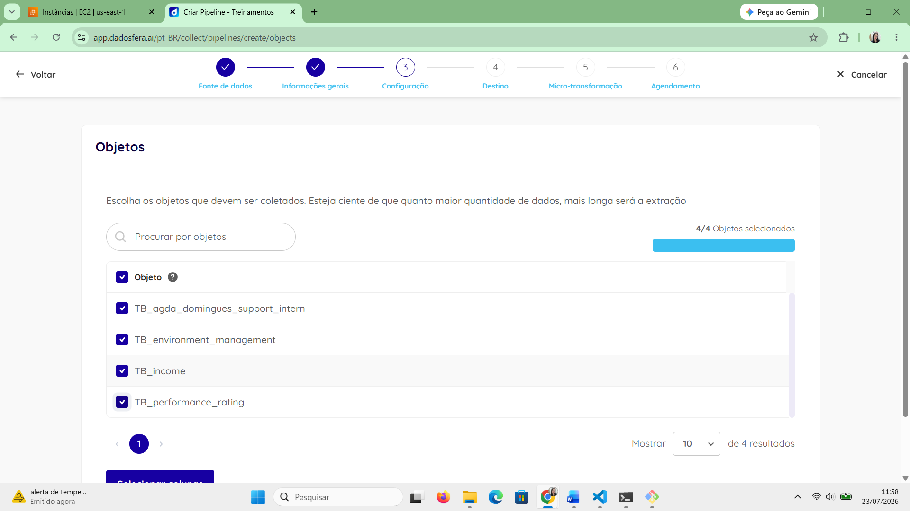
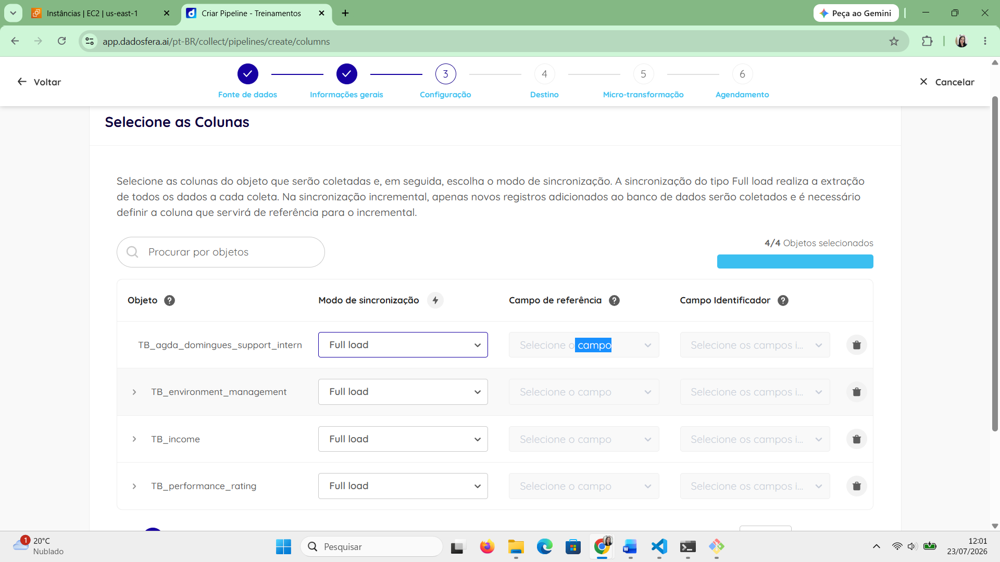
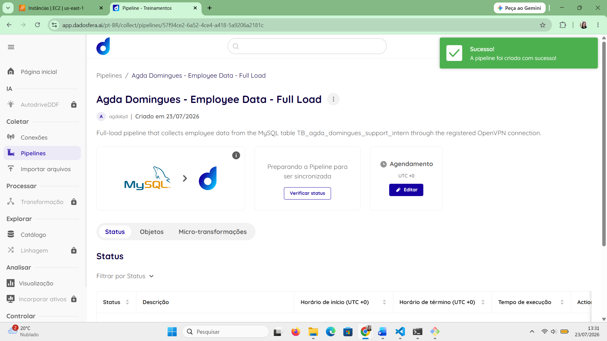
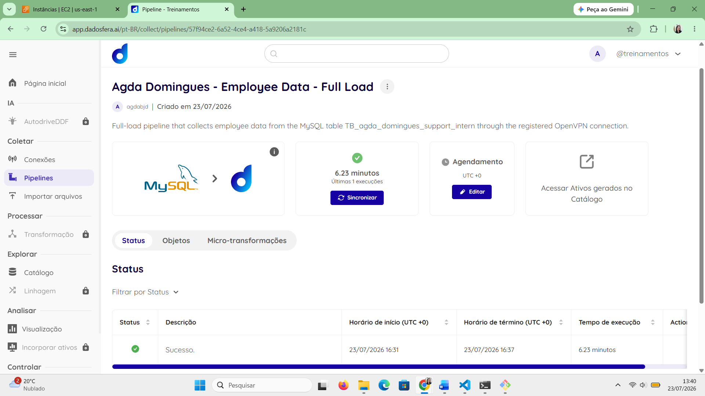
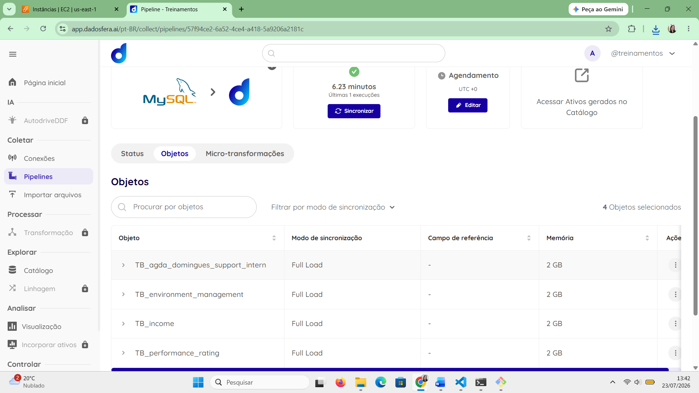

# Step 4 – Conexão com a Dadosfera

Neste passo, foi necessário cadastrar o banco MySQL como uma fonte de dados na plataforma Dadosfera, validar a conexão por meio da VPN criada no Step 3 e configurar uma pipeline para coletar os dados armazenados na instância AWS EC2.

Como o banco permaneceu sem exposição pública da porta 3306, a conexão foi realizada utilizando o IP privado da instância e a rede OpenVPN cadastrada anteriormente. Dessa forma, o tráfego entre a plataforma e o MySQL foi direcionado pelo túnel VPN, mantendo o banco inacessível diretamente pela internet.

Embora o enunciado exigisse explicitamente a coleta da tabela `TB_agda_domingues_support_intern`, a pipeline foi configurada para importar também as três tabelas complementares criadas no Step 2. Essa decisão preservou todo o conjunto de dados disponibilizado no case e permitiu que as informações relacionadas pudessem ser utilizadas posteriormente em consultas SQL por meio da coluna `EmployeeNumber`.

O Step 4 foi dividido em 7 passos menores:

1. Cadastro da fonte de dados MySQL;
2. Preenchimento das informações gerais da pipeline;
3. Seleção das tabelas para coleta;
4. Seleção das colunas;
5. Configuração do destino e criação da pipeline;
6. Execução e validação da importação;
7. Conferência das tabelas carregadas.

---

## Passo 1 – Cadastro da fonte de dados MySQL

Com a VPN ativa e cadastrada na plataforma, foi criada uma nova fonte de dados do tipo MySQL.

A conexão foi configurada utilizando:

- O IP privado da instância AWS EC2 como endpoint;
- A porta padrão do MySQL, `3306`;
- O banco `agda_domingues_support_intern`;
- O usuário `dadosfera`, criado anteriormente com permissão somente de leitura;
- A conexão OpenVPN cadastrada no Step 3.

O IP privado foi utilizado porque a plataforma acessa o servidor por meio da rota distribuída pela VPN. Dessa forma, não foi necessário informar o IPv4 público da instância nem abrir a porta 3306 no Security Group para a internet.

O schema de origem foi definido como `agda_domingues_support_intern`

O valor `information_schema`, preenchido inicialmente pela interface, não foi mantido porque representa um banco interno de metadados do MySQL e não contém as tabelas utilizadas no case.

Após o preenchimento das credenciais e das informações de rede, a conexão foi testada diretamente pela interface da Dadosfera e o teste foi concluído com sucesso.

---

## Passo 2 – Informações gerais da pipeline

Após validar a fonte de dados, foi iniciada a criação de uma nova pipeline.

Foram preenchidas as informações de identificação da pipeline, incluindo nome e descrição relacionados ao banco MySQL e ao case técnico. A descrição foi elaborada para indicar que a pipeline realiza uma carga completa dos dados hospedados na instância EC2 e acessados por meio da conexão OpenVPN.

---

## Passo 3 – Seleção das tabelas para coleta

Na etapa de configuração da fonte, a plataforma identificou as quatro tabelas criadas no banco:

`TB_agda_domingues_support_intern`
`TB_performance_rating`
`TB_environment_management`
`TB_income`

A tabela obrigatória definida pelo enunciado (`TB_agda_domingues_support_intern`) foi incluída.

Também foram selecionadas as três tabelas complementares.

Essa decisão foi tomada porque os dados originais estavam divididos em quatro abas e haviam sido modelados como tabelas relacionadas no MySQL. A importação das quatro entidades preserva o conjunto completo e possibilita análises posteriores utilizando `JOIN` pela coluna comum `EmployeeNumber`.

---

## Passo 4 – Seleção das colunas

Após selecionar as entidades, foram revisadas as colunas disponíveis em cada tabela.

Todas as colunas foram mantidas na coleta.

Essa escolha foi feita porque:

- O volume de dados era pequeno;
- O case utiliza diferentes atributos nas análises posteriores;
- A exclusão antecipada de colunas poderia limitar as consultas do Step 6;
- A carga completa preserva a estrutura original da base.

---

## Passo 5 – Configuração do destino e criação da pipeline

Na etapa de destino, foi mantido o schema padrão da plataforma `PUBLIC`.

Esse schema corresponde ao destino dos dados dentro do data warehouse da Dadosfera e não ao schema de origem do MySQL.

O modo de sincronização utilizado foi `Full load`.

O Full Load foi escolhido porque:

- O conjunto possuía apenas 1470 registros por tabela;
- Não havia necessidade de configurar uma carga incremental;
- O objetivo era realizar uma importação completa e consistente dos dados.

Os nomes das tabelas de destino foram deixados em branco para que a plataforma realizasse sua geração automática.

Não foram adicionadas microtransformações, pois os dados já haviam sido tratados e estruturados no banco de origem.

Após revisar as configurações, a pipeline foi criada com sucesso.

---

## Passo 6 – Execução e validação da importação

Após a criação, a pipeline foi executada para iniciar a coleta dos dados do MySQL.

A execução foi acompanhada pela interface até a conclusão.

O status final confirmou que a importação foi realizada com sucesso.

Essa validação comprovou o funcionamento conjunto de todos os componentes configurados nos passos anteriores:

- AWS EC2;
- MySQL;
- Usuário de leitura;
- OpenVPN;
- Rota privada;
- Fonte de dados;
- Pipeline Full Load.

---

## Passo 7 – Conferência das tabelas carregadas

Após a conclusão da execução, foram verificadas as entidades carregadas pela pipeline.

A interface confirmou a importação das quatro tabelas selecionadas.

As quatro tabelas criadas com os dados do GoogleSheets foram disponibilizadas na plataforma.

Com isso, os dados ficaram disponíveis para as etapas seguintes, incluindo o Catálogo de Dados e a criação das consultas SQL no módulo de Visualização.

---

## Resultado do Step 4

Ao final desta etapa, a base MySQL foi conectada à plataforma Dadosfera e seus dados foram importados com sucesso por meio de uma pipeline.

O Step 4 foi concluído com os seguintes resultados:

- Fonte de dados MySQL criada;
- Conexão realizada por meio da OpenVPN;
- IP privado da instância utilizado como endpoint;
- Usuário `dadosfera` utilizado para autenticação;
- Banco `agda_domingues_support_intern` selecionado;
- Teste de conexão concluído com sucesso pela interface;
- Pipeline criada;
- Tabelas selecionadas e todas as colunas mantidas;
- Schema de destino `PUBLIC` selecionado;
- Modo de sincronização `Full load` utilizado;
- Pipeline executada com sucesso;
- Quatro tabelas importadas para a plataforma;
- Dados preparados para consulta no Catálogo da Dadosfera.

Com isso, a conexão entre o banco MySQL hospedado na AWS EC2 e a plataforma Dadosfera foi concluída, permitindo o avanço para o Step 5, no qual os ativos importados serão localizados e documentados no Catálogo de Dados.