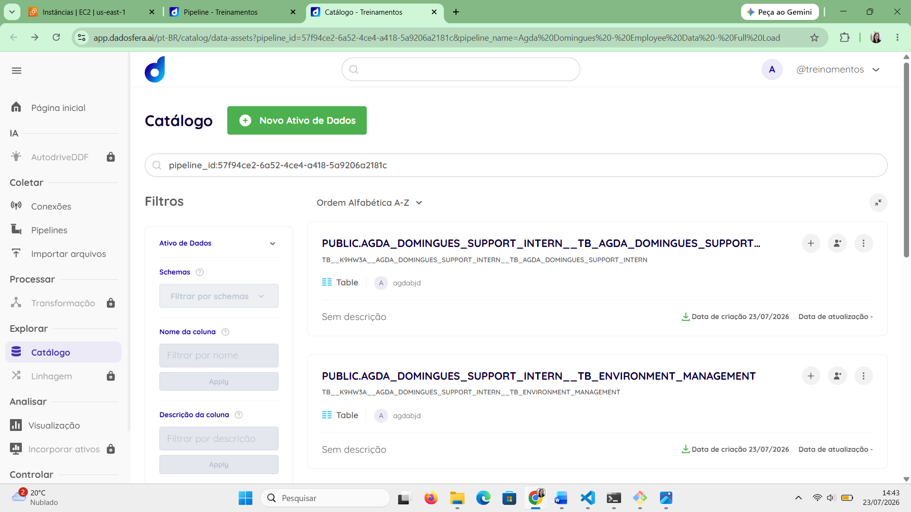
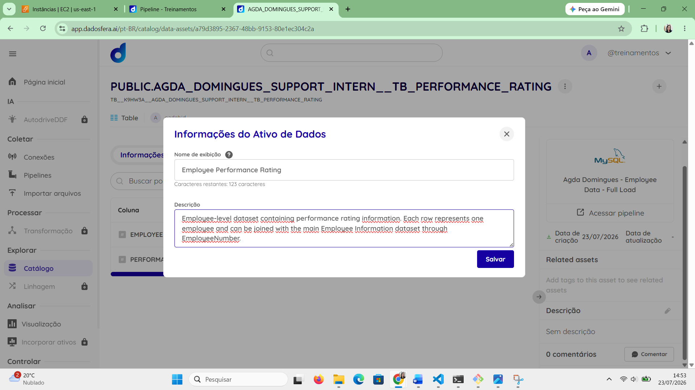
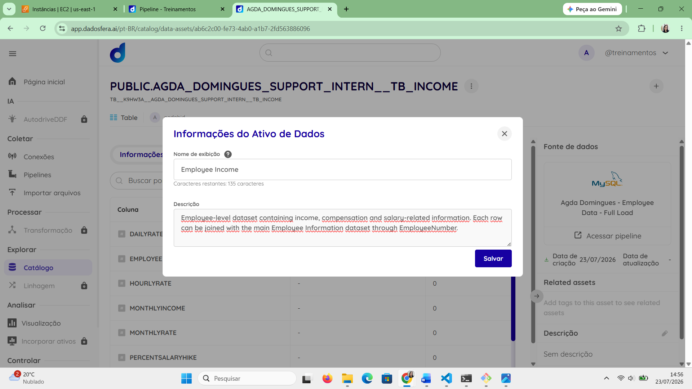

# Step 5 – Catálogo de Dados

Neste passo, foi necessário validar a disponibilização dos resultados da pipeline no Catálogo da Dadosfera e documentar os datasets importados com nomes amigáveis e descrições.

Como a pipeline criada no Step 4 foi executada com sucesso, cada tabela selecionada foi automaticamente disponibilizada como um ativo no Catálogo. A partir disso, foram localizados os quatro datasets correspondentes às tabelas importadas do MySQL.

O Step 5 foi dividido em 2 passos menores:

1. Validação das tabelas no Catálogo;
2. Documentação dos datasets.

---

## Passo 1 – Validação das tabelas no Catálogo

Após a conclusão da pipeline, foi acessado o Catálogo de Dados da plataforma.

As quatro tabelas importadas foram localizadas, com nomes gerados automaticamente pela plataforma.

A presença desses ativos confirmou que o resultado da pipeline estava disponível para consulta e utilização nas etapas seguintes do case.

---

## Passo 2 – Documentação dos datasets

Realizei a documentação das quatro tabelas encontradas.

### Tabela principal

A tabela `TB_agda_domingues_support_intern` recebeu o nome amigável `Employee Information`.

A descrição foi definida para informar que cada registro representa um funcionário, identificado pelo campo `EmployeeNumber`, e que a tabela contém informações demográficas, profissionais e organizacionais.

Também foi registrado que o dataset pode ser relacionado às tabelas complementares por meio do campo `EmployeeNumber`.

### Tabela de avaliação de desempenho

A tabela `TB_performance_rating` recebeu o nome amigável `Employee Performance Rating`.

A descrição informa que o dataset contém as avaliações de desempenho dos funcionários e pode ser relacionado à tabela principal por meio do campo `EmployeeNumber`.

### Tabela de ambiente e satisfação

A tabela `TB_environment_management` recebeu o nome amigável `Employee Environment Management`.

A descrição foi elaborada para indicar que o dataset contém informações relacionadas ao ambiente de trabalho, satisfação, envolvimento, treinamentos, equilíbrio entre vida profissional e pessoal e desligamento dos funcionários.

### Tabela de renda

A tabela `TB_income` recebeu o nome amigável `Employee Income`.

A descrição informa que o dataset contém informações salariais, de renda e de remuneração dos funcionários, podendo ser relacionado às demais tabelas por meio do campo `EmployeeNumber`.

---

## Resultado do Step 5

Ao final desta etapa, os dados importados pela pipeline estavam disponíveis e documentados no Catálogo da Dadosfera.

O Step 5 foi concluído com os seguintes resultados:

- Tabelas importadas localizadas no Catálogo;
- Disponibilidade dos dados para consulta validada;
- Nomes amigáveis adicionados aos quatro datasets;
- Descrições inseridas para facilitar a identificação e utilização dos dados;
- Relacionamento por `EmployeeNumber` registrado nas descrições.

Com isso, os ativos de dados ficaram organizados e preparados para a criação das consultas SQL e visualizações solicitadas no Step 6.