# Step 6 – Item Consultas SQL

O passo 6 se trata da consulta e visualização dos dados cadastrados no banco de dados criado durante o Step 2. O case técnico orienta a criação das visualizações por meio da plataforma da Dadosfera, porém, isso depende obrigatoriamente de acesso autenticado. As credenciais de acesso foram solicitadas ao responsável pelo processo seletivo em 17/07/2026, porém não foram disponibilizadas até o prazo de entrega deste case. Em razão dessa limitação, optei por realizar as consultas SQL diretamente no servidor Ubuntu e criar as visualizações no Excel e Google Sheets.

O Step 6 foi dividido em duas etapas:
1. Realizar as consultas SQL ao banco de dados;
2. Criar a visualização dos dados no Excel e Google Sheets.

## Passo 1 - Queries SQL
As consultas foram escolhidas buscando apresentar indicadores descritivos relevantes para uma área de Customer Service e Recursos Humanos, permitindo analisar a distribuição da força de trabalho, características demográficas e indicadores relacionados à permanência e ao histórico profissional dos colaboradores.

| Indicador | Objetivo da análise |
| :---: | :---: |
| Funcionários por departamento | Avaliar a distribuição da equipe entre os departamentos. |
| Média de idade | Identificar diferenças no perfil etário entre áreas. |
| Horas extras | Verificar a proporção de colaboradores que realizam horas extras. |
| Escolaridade | Conhecer o nível de formação predominante. |
| Tempo de empresa | Avaliar retenção e experiência média dos colaboradores. |
| Funcionários por cargo | Identificar cargos com maior representatividade. |
| Distribuição por gênero | Avaliar a composição da força de trabalho. |
| Gênero por cargo | Verificar a distribuição de gênero entre os diferentes cargos. |
| Empresas anteriores | Analisar a experiência profissional média antes da contratação. |

### Primeiro print
Nele constam as queries para descobrir, respectivamente:
1. Número de funcionários por departamento;
2. Média de idade por departamento.
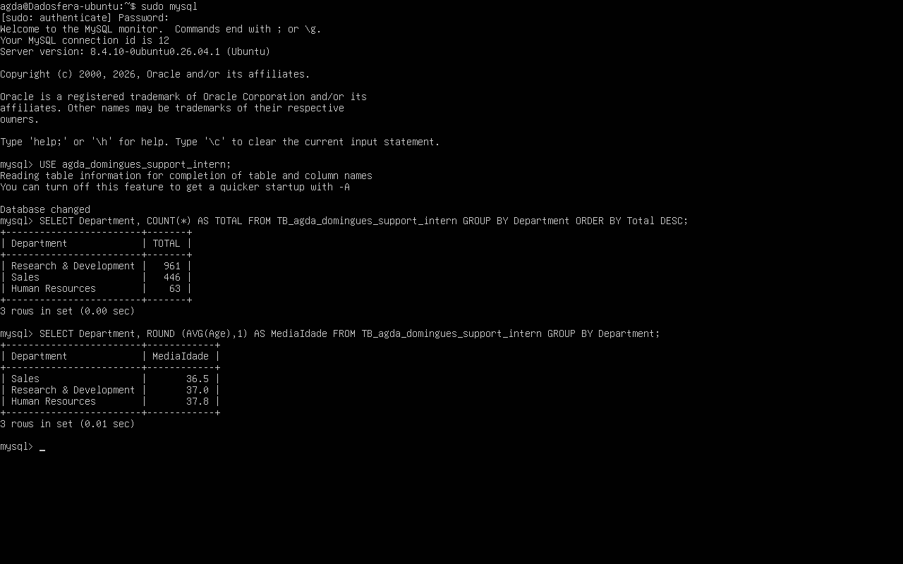

### Segundo print
Nele constam as queries para descobrir, respectivamente:
1. Quantidade de funcionários que fizeram (ou não) hora extra;
2. Quantidade de funcionários por nível de escolaridade.
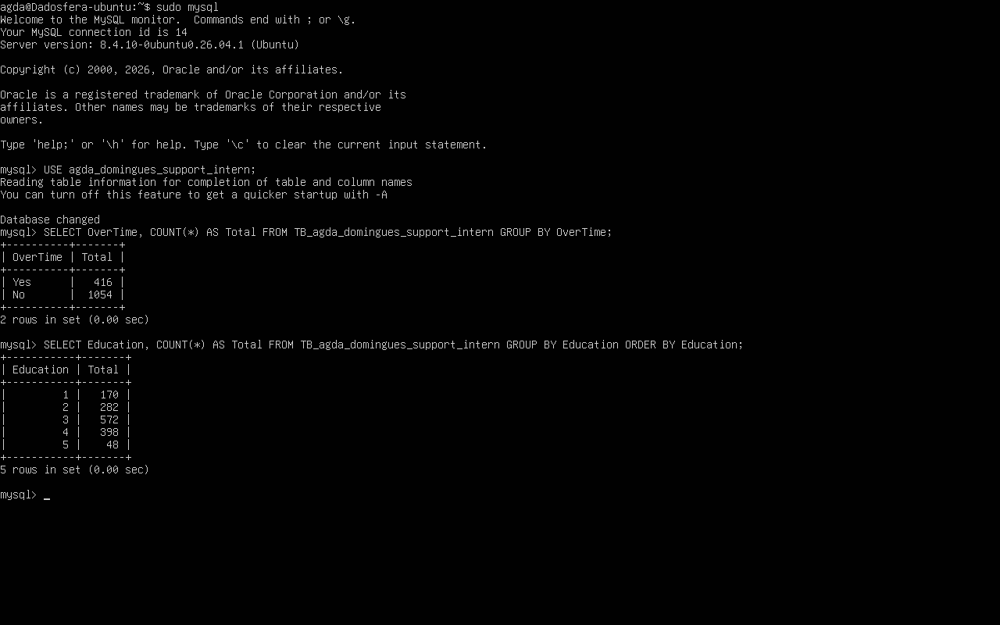

### Terceiro print
Nele constam as queries para descobrir, respectivamente:
1. Tempo médio em anos que os funcionários trabalham na empresa, por departamento;
2. Número de funcionários por cargo.
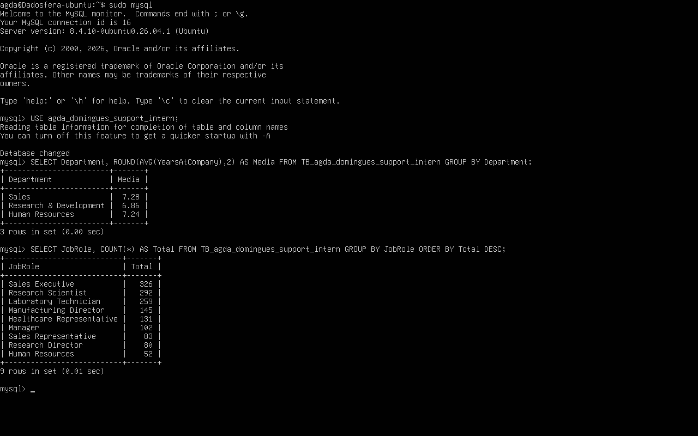

### Quarto print
Nele constam as queries para descobrir, respectivamente:
1. Distribuição de funcionários por gênero;
2. Distribuição dos cargos por gênero.
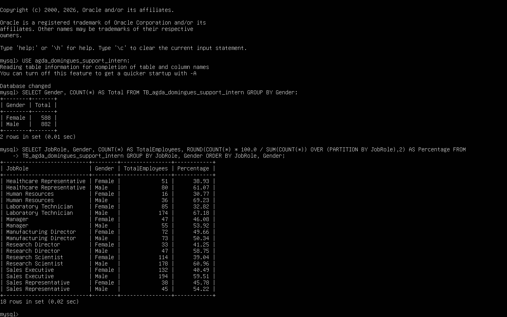

### Quinto print
Nele consta a query para descobrir a média de empresas que os funcionários já trabalharam por departamento.
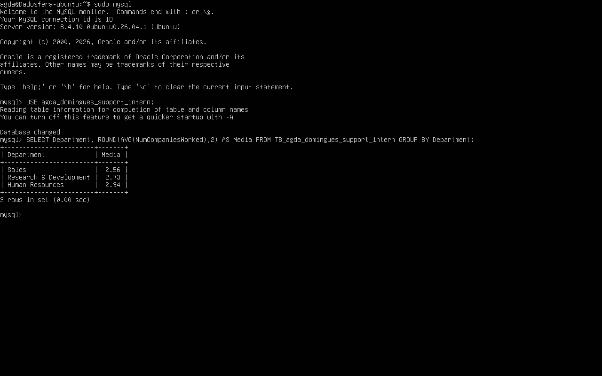

## Passo 2 - Visualização de dados
Após a execução das consultas SQL, os resultados foram transformados em gráficos para facilitar a interpretação das informações. A visualização de dados permite identificar padrões, tendências e diferenças entre grupos com maior rapidez do que a análise de tabelas numéricas, tornando os resultados mais úteis para apoiar decisões de negócio.

Os resultados das consultas foram exportados para planilhas e utilizados para gerar visualizações no Microsoft Excel. Apenas a visualização referente à distribuição de gênero por cargo foi construída no Google Sheets, devido à maior flexibilidade da ferramenta para esse tipo de gráfico.

### Total de funcionários por departamento
**Consulta SQL**: ```SELECT Department, COUNT(*) AS Total FROM TB_agda_domingues_support_intern GROUP BY Department ORDER BY Total DESC;```
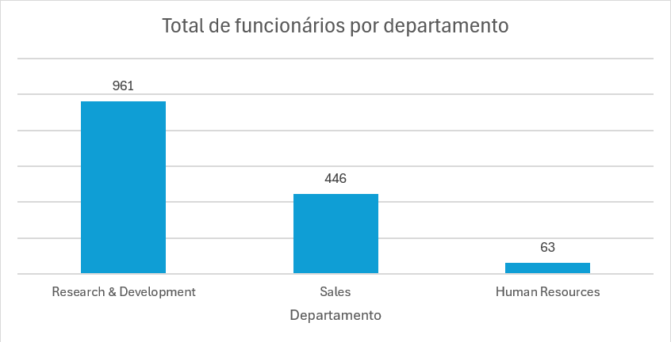

### Média de idade por departamento
**Consulta SQL**: ```SELECT Department, ROUND(AVG(Age),1) AS MediaIdade FROM TB_agda_domingues_support_intern GROUP BY Department;```
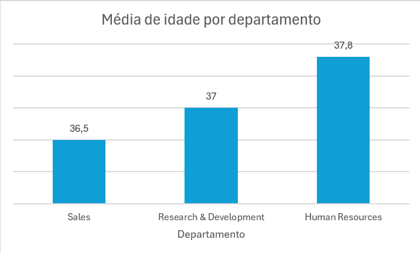

### Porcentagem de funcionários que fizeram hora extra
**Consulta SQL**: ```SELECT OverTime, COUNT(*) AS Total FROM TB_agda_domingues_support_intern GROUP BY OverTime;```
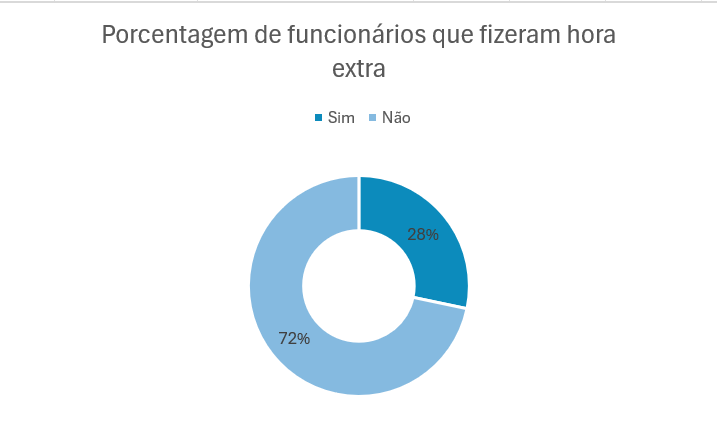

### Quantidade de funcionários por nível de escolaridade
**Consulta SQL**: ```SELECT Education, COUNT(*) AS Total FROM TB_agda_domingues_support_intern GROUP BY Education ORDER BY Education;```
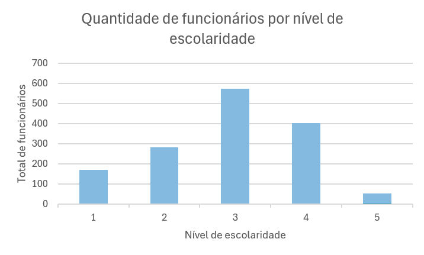

### Média de anos na empresa por departamento
**Consulta SQL**: ```SELECT Department, ROUND(AVG(YearsAtCompany),2) AS Media FROM TB_agda_domingues_support_intern GROUP BY Department;```
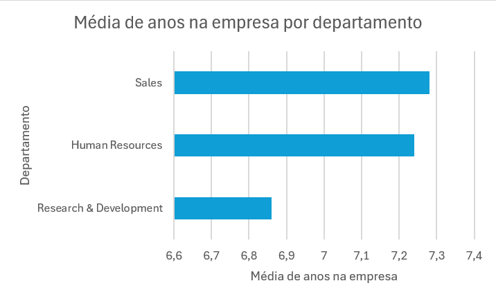

### Total de funcionários por cargo
**Consulta SQL**: ```SELECT JobRole, COUNT(*) AS Total FROM TB_agda_domingues_support_intern GROUP BY JobRole ORDER BY Total DESC;```
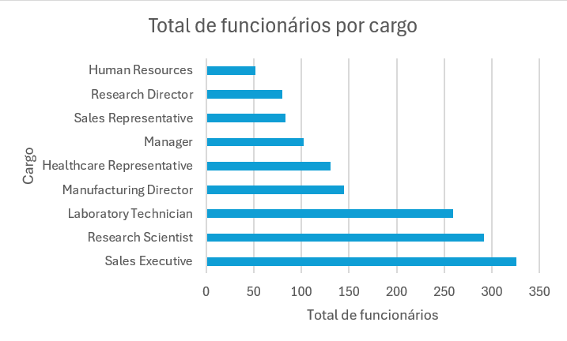

### Total de funcionários por gênero
**Consulta SQL**: ```SELECT Gender, COUNT(*) AS Total FROM TB_agda_domingues_support_intern GROUP BY Gender;```
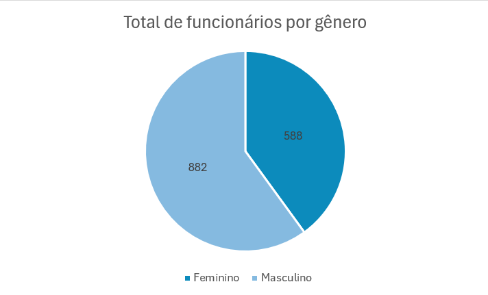

### Distribuição de gênero por cargo
**Consulta SQL**: ```SELECT JobRole, Gender, COUNT(*) AS TotalEmployees, ROUND( COUNT(*) * 100.0 / SUM(COUNT(*)) OVER (PARTITION BY JobRole), 2 ) AS Percentage FROM TB_agda_domingues_support_intern GROUP BY JobRole, Gender ORDER BY JobRole, Gender;```
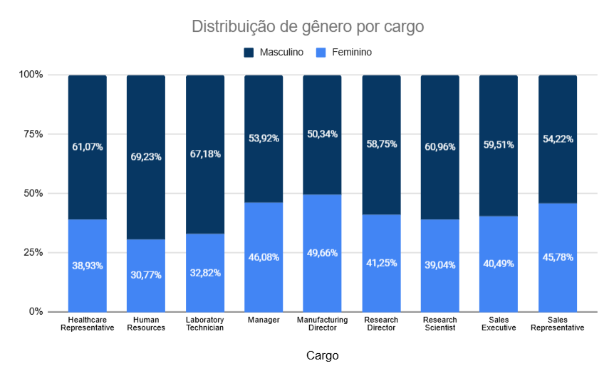

### Média do número de empresas que os funcionários já trabalharam por departamento
**Consulta SQL**: ```SELECT Department, ROUND(AVG(NumCompaniesWorked),2) AS Media FROM TB_agda_domingues_support_intern GROUP BY Department;```
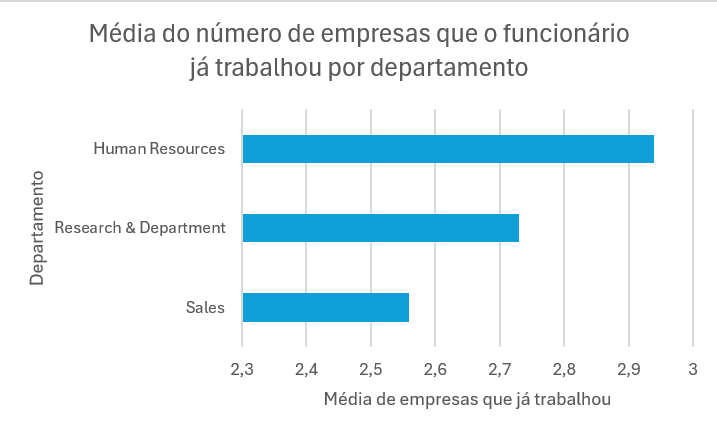

Com isso, foi possível realizar todas as consultas SQL previstas para esta etapa e produzir visualizações equivalentes às que seriam criadas no módulo de Visualização da Dadosfera. Embora a indisponibilidade de acesso à plataforma tenha impedido a utilização da ferramenta oficial, as análises foram executadas integralmente sobre a base de dados importada localmente, preservando o objetivo técnico do desafio.