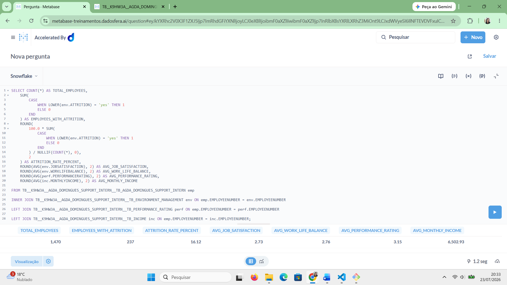
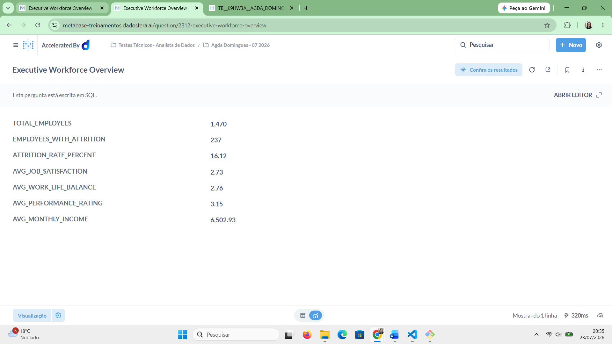
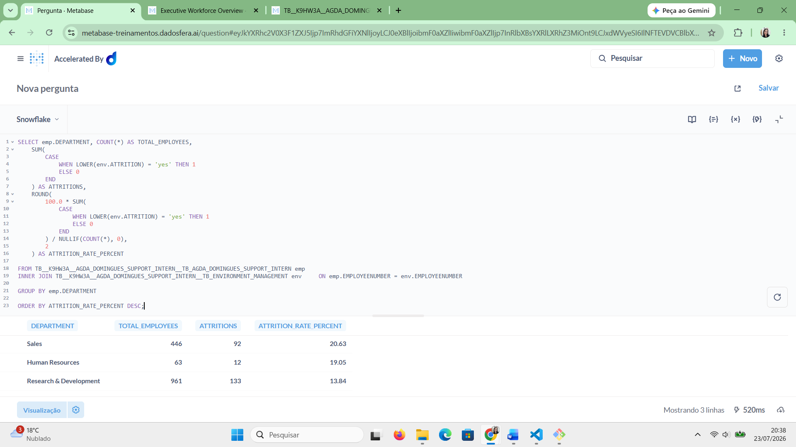
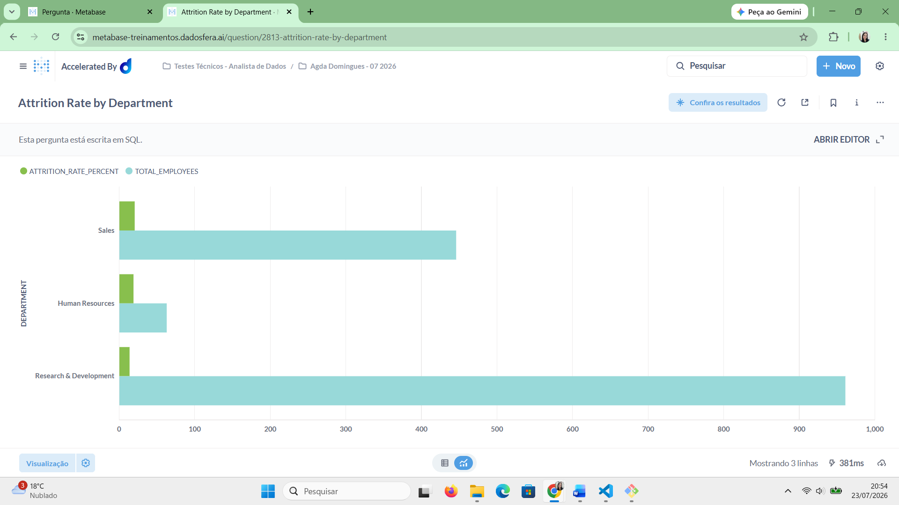
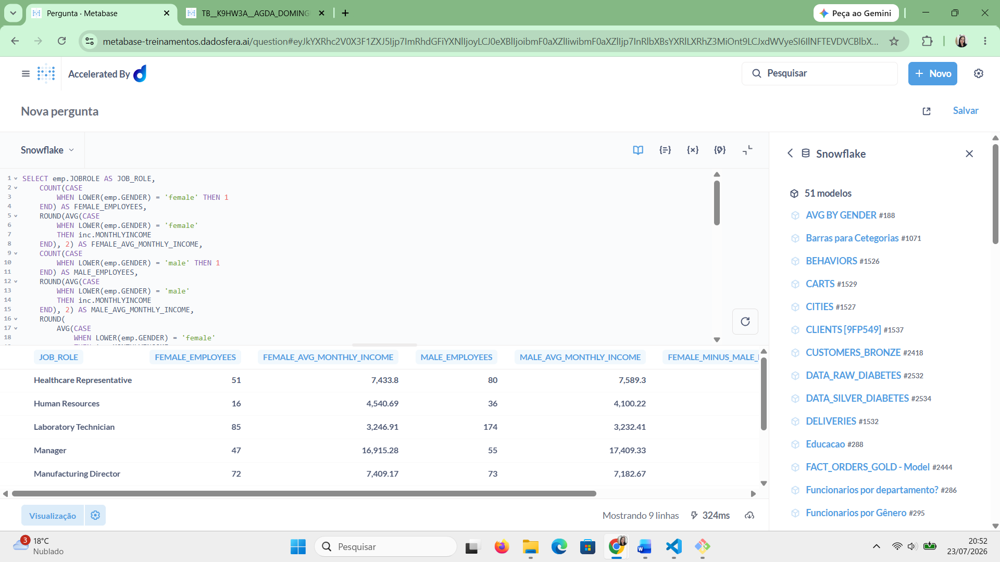
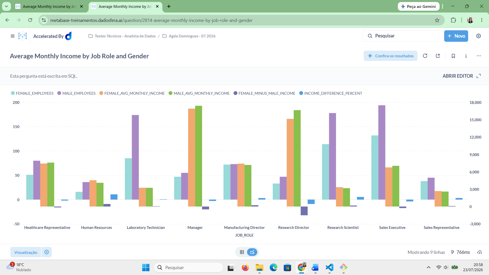

# Step 6 – Consultas SQL e Visualizações

Neste passo, foi utilizado o módulo de Visualização da Dadosfera para criar análises descritivas com base nos dados importados por meio da conexão OpenVPN.

As consultas foram desenvolvidas utilizando os identificadores técnicos das tabelas disponibilizados no Catálogo da Dadosfera. Como os dados haviam sido modelados em quatro tabelas relacionais, foram utilizados `JOINs` pela coluna `EmployeeNumber` para combinar informações cadastrais, ambiente de trabalho, desempenho e renda.

As análises foram salvas em uma coleção chamada `Agda Domingues - 07 2026` criada dentro da pasta `Testes Técnicos - Analista de Dados`, seguindo o padrão de nomenclatura solicitado no case.

O Step 6 foi dividido em três análises:

1. Visão executiva da força de trabalho;
2. Taxa de desligamento por departamento;
3. Comparação salarial por cargo e gênero.

---

## Análise 1 – Executive Workforce Overview

A primeira consulta foi criada para apresentar uma visão executiva dos principais indicadores da força de trabalho.

Foram calculados:

- Total de funcionários;
- Quantidade de desligamentos;
- Taxa geral de desligamento;
- Média de satisfação no trabalho;
- Média de equilíbrio entre vida profissional e pessoal;
- Média das avaliações de desempenho;
- Média salarial mensal.

Para consolidar essas informações, foram utilizadas as quatro tabelas importadas. A tabela principal foi relacionada às tabelas complementares por meio da coluna `EmployeeNumber`.

A tabela de ambiente foi associada com `INNER JOIN`, pois contém os dados necessários para os indicadores de desligamento e satisfação. As tabelas de desempenho e renda foram associadas com `LEFT JOIN`, preservando os registros da base principal mesmo quando algum valor complementar estivesse ausente.

```sql
SELECT
    COUNT(*) AS TOTAL_EMPLOYEES,

    SUM(
        CASE
            WHEN LOWER(env.ATTRITION) = 'yes' THEN 1
            ELSE 0
        END
    ) AS EMPLOYEES_WITH_ATTRITION,

    ROUND(
        100.0 * SUM(
            CASE
                WHEN LOWER(env.ATTRITION) = 'yes' THEN 1
                ELSE 0
            END
        ) / NULLIF(COUNT(*), 0),
        2
    ) AS ATTRITION_RATE_PERCENT,

    ROUND(AVG(env.JOBSATISFACTION), 2) AS AVG_JOB_SATISFACTION,

    ROUND(AVG(env.WORKLIFEBALANCE), 2) AS AVG_WORK_LIFE_BALANCE,

    ROUND(AVG(perf.PERFORMANCERATING), 2) AS AVG_PERFORMANCE_RATING,

    ROUND(AVG(inc.MONTHLYINCOME), 2) AS AVG_MONTHLY_INCOME

FROM TB__K9HW3A__AGDA_DOMINGUES_SUPPORT_INTERN__TB_AGDA_DOMINGUES_SUPPORT_INTERN emp

INNER JOIN TB__K9HW3A__AGDA_DOMINGUES_SUPPORT_INTERN__TB_ENVIRONMENT_MANAGEMENT env ON emp.EMPLOYEENUMBER = env.EMPLOYEENUMBER

LEFT JOIN TB__K9HW3A__AGDA_DOMINGUES_SUPPORT_INTERN__TB_PERFORMANCE_RATING perf ON emp.EMPLOYEENUMBER = perf.EMPLOYEENUMBER

LEFT JOIN TB__K9HW3A__AGDA_DOMINGUES_SUPPORT_INTERN__TB_INCOME inc ON emp.EMPLOYEENUMBER = inc.EMPLOYEENUMBER;
```



O resultado foi apresentado como uma tabela de indicadores, permitindo uma leitura rápida da situação geral da força de trabalho.



---

## Análise 2 – Attrition Rate by Department

A segunda consulta foi criada para comparar a taxa de desligamento entre os departamentos.

Além da quantidade total de funcionários e desligamentos, foi calculada a proporção de desligamentos dentro de cada departamento.

A utilização da taxa percentual, em vez de apenas valores absolutos, evita que departamentos maiores sejam interpretados automaticamente como áreas de maior risco apenas por possuírem mais funcionários.

A função `NULLIF` foi utilizada para impedir uma eventual divisão por zero.

```sql
SELECT emp.DEPARTMENT, COUNT(*) AS TOTAL_EMPLOYEES,

    SUM(
        CASE
            WHEN LOWER(env.ATTRITION) = 'yes' THEN 1
            ELSE 0
        END
    ) AS ATTRITIONS,

    ROUND(
        100.0 * SUM(
            CASE
                WHEN LOWER(env.ATTRITION) = 'yes' THEN 1
                ELSE 0
            END
        ) / NULLIF(COUNT(*), 0),
        2
    ) AS ATTRITION_RATE_PERCENT

FROM TB__K9HW3A__AGDA_DOMINGUES_SUPPORT_INTERN__TB_AGDA_DOMINGUES_SUPPORT_INTERN emp

INNER JOIN TB__K9HW3A__AGDA_DOMINGUES_SUPPORT_INTERN__TB_ENVIRONMENT_MANAGEMENT env ON emp.EMPLOYEENUMBER = env.EMPLOYEENUMBER

GROUP BY emp.DEPARTMENT

ORDER BY ATTRITION_RATE_PERCENT DESC;
```



O resultado foi transformado em uma visualização comparativa, ordenada da maior para a menor taxa de desligamento.



A análise permite identificar os departamentos com maior proporção de desligamentos, servindo como ponto de partida para investigações adicionais sobre clima, carga de trabalho, liderança ou oportunidades de desenvolvimento.

---

## Análise 3 – Average Monthly Income by Job Role and Gender

A terceira consulta foi criada para comparar a média salarial mensal de mulheres e homens dentro dos mesmos cargos.

A comparação foi realizada por cargo para evitar uma análise agregada que pudesse ser influenciada pela distribuição desigual de homens e mulheres entre funções diferentes.

Foram calculados:

- Quantidade de mulheres em cada cargo;
- Média salarial mensal das mulheres;
- Quantidade de homens em cada cargo;
- Média salarial mensal dos homens;
- Diferença absoluta entre as médias;
- Diferença percentual em relação à média masculina.

A cláusula `HAVING` garantiu que apenas cargos com presença dos dois grupos fossem exibidos.

```sql
SELECT emp.JOBROLE AS JOB_ROLE,

    COUNT(
        CASE
            WHEN LOWER(emp.GENDER) = 'female' THEN 1
        END
    ) AS FEMALE_EMPLOYEES,

    ROUND(
        AVG(
            CASE
                WHEN LOWER(emp.GENDER) = 'female'
                THEN inc.MONTHLYINCOME
            END
        ),
        2
    ) AS FEMALE_AVG_MONTHLY_INCOME,

    COUNT(
        CASE
            WHEN LOWER(emp.GENDER) = 'male' THEN 1
        END
    ) AS MALE_EMPLOYEES,

    ROUND(
        AVG(
            CASE
                WHEN LOWER(emp.GENDER) = 'male'
                THEN inc.MONTHLYINCOME
            END
        ),
        2
    ) AS MALE_AVG_MONTHLY_INCOME,

    ROUND(
        AVG(
            CASE
                WHEN LOWER(emp.GENDER) = 'female'
                THEN inc.MONTHLYINCOME
            END
        )
        -
        AVG(
            CASE
                WHEN LOWER(emp.GENDER) = 'male'
                THEN inc.MONTHLYINCOME
            END
        ),
        2
    ) AS FEMALE_MINUS_MALE_INCOME,

    ROUND(
        100.0 * (
            AVG(
                CASE
                    WHEN LOWER(emp.GENDER) = 'female'
                    THEN inc.MONTHLYINCOME
                END
            )
            -
            AVG(
                CASE
                    WHEN LOWER(emp.GENDER) = 'male'
                    THEN inc.MONTHLYINCOME
                END
            )
        )
        / NULLIF(
            AVG(
                CASE
                    WHEN LOWER(emp.GENDER) = 'male'
                    THEN inc.MONTHLYINCOME
                END
            ),
            0
        ),
        2
    ) AS INCOME_DIFFERENCE_PERCENT

FROM TB__K9HW3A__AGDA_DOMINGUES_SUPPORT_INTERN__TB_AGDA_DOMINGUES_SUPPORT_INTERN AS emp

INNER JOIN TB__K9HW3A__AGDA_DOMINGUES_SUPPORT_INTERN__TB_INCOME AS inc ON emp.EMPLOYEENUMBER = inc.EMPLOYEENUMBER

GROUP BY emp.JOBROLE

HAVING
    COUNT(
        CASE
            WHEN LOWER(emp.GENDER) = 'female' THEN 1
        END
    ) > 0
    AND
    COUNT(
        CASE
            WHEN LOWER(emp.GENDER) = 'male' THEN 1
        END
    ) > 0

ORDER BY emp.JOBROLE;
```



A visualização permitiu comparar diretamente as médias salariais de mulheres e homens em cada função.



Essa análise possui caráter exploratório. As diferenças observadas não permitem concluir, isoladamente, a existência de desigualdade salarial causada por gênero, pois outros fatores, como experiência, senioridade, tempo de empresa e responsabilidades específicas, não foram controlados.

---

## Resultado do Step 6

Ao final desta etapa, foram criadas três análises descritivas utilizando os dados importados para a Dadosfera.

O Step 6 foi concluído com os seguintes resultados:

- Coleção criada no módulo de Visualização;
- Consultas SQL desenvolvidas com relacionamento entre as tabelas;
- Visão executiva dos principais indicadores da força de trabalho criada;
- Taxa de desligamento por departamento calculada;
- Comparação salarial por cargo e gênero realizada;
- Queries SQL salvas;
- Resultados transformados em visualizações;
- Evidências das consultas e visualizações registradas no repositório.

Com isso, os dados importados foram utilizados para produzir análises descritivas relevantes para a liderança, contemplando indicadores de força de trabalho, retenção e remuneração.